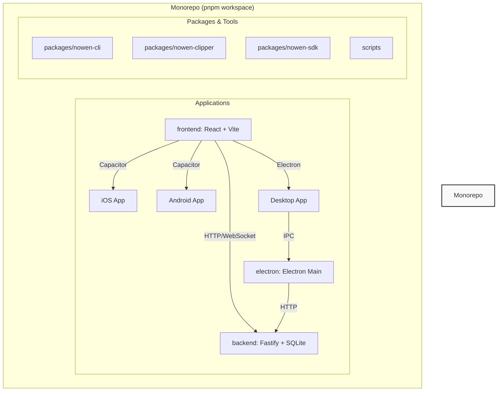

Now-Noting 是一款开源、支持自部署的笔记应用程序，旨在为用户提供一个安全、私密且功能丰富的知识管理解决方案。它通过整合现代化的技术栈，实现了在桌面端（Windows, macOS, Linux）、Web 端以及移动端（iOS, Android）的无缝体验。本文档将从宏观视角介绍其技术架构、核心功能以及项目结构，为初次接触的开发者提供一个清晰的入口。

来源: [README.md](README.md#L1-L7)

## 核心特性

Now-Noting 的设计哲学围绕着数据所有权、可扩展性和跨平台可用性。以下是其关键特性的总结，这些特性共同构成了一个全面的个人知识管理系统。

| 功能分类 | 特性描述 | 技术实现亮点 |
| :--- | :--- | :--- |
| **跨平台支持** | 一套代码库支持桌面、Web 和移动端。 | Electron (桌面), Capacitor (移动), React (Web) |
| **编辑器** | 所见即所得的富文本编辑器，支持 Markdown。 | Tiptap 编辑器框架 |
| **数据管理** | 支持自部署，用户数据完全私有。 | 使用 SQLite 进行数据持久化，支持附件存储。 |
| **AI 功能集成** | 内置 AI 助手，可用于文本生成、摘要、翻译等。 | 与兼容 OpenAI API 的大语言模型集成。 |
| **数据同步** | 支持多设备间的数据自动同步。 | 后端服务协调数据同步逻辑。 |
| **网页剪藏** | 提供浏览器扩展，方便快速保存网页内容。 | `nowen-clipper` 浏览器插件 |
| **扩展性** | 设计了插件化架构，允许开发者扩展核心功能。 | 后端基于 Fastify 的插件系统。 |

来源: [package.json](package.json), [frontend/package.json](frontend/package.json), [electron/main.js](electron/main.js), [frontend/capacitor.config.ts](frontend/capacitor.config.ts)

## 技术架构概览

Now-Noting 采用 Monorepo（单一代码仓库）策略来管理其复杂的多端应用。这种结构将所有相关的子项目（如前端、后端、桌面端应用和各种工具库）集中在一个仓库中，极大地简化了依赖管理和跨项目协作。



该架构的核心可以分解为几个关键部分：
1.  **后端 (Backend)**: 基于 [Fastify](https://fastify.dev/) 框架构建，采用插件化设计。它负责处理核心业务逻辑，如用户认证、数据存储（使用 SQLite）、附件管理和 WebSocket 通信，为所有客户端提供统一的 API 服务。
2.  **前端 (Frontend)**: 使用 [React](https://react.dev/) 和 [Vite](https://vitejs.dev/) 构建的单页应用（SPA）。这是所有用户界面的核心，为不同平台提供一致的交互体验。
3.  **桌面端 (Electron)**: 将前端应用封装成一个原生的桌面应用程序。Electron 的主进程（`electron/main.js`）负责管理窗口、菜单、系统托盘以及与操作系统的深度集成，并通过进程间通信（IPC）与渲染进程（前端页面）交互。
4.  **移动端 (Capacitor)**: [Capacitor](https://capacitorjs.com/) 将前端的 Web 应用打包成原生的 iOS 和 Android 应用，并提供了访问原生设备功能（如文件系统、相机等）的桥梁。
5.  **工具包 (Packages)**: Monorepo 内的 `packages` 目录包含多个可重用的模块，如命令行工具（`nowen-cli`）和网页剪藏器（`nowen-clipper`），这些模块与主应用解耦，可以独立开发和维护。

来源: [package.json](package.json#L7-L11), [backend/src/index.ts](backend/src/index.ts), [frontend/capacitor.config.ts](frontend/capacitor.config.ts), [electron/main.js](electron/main.js)

## 项目结构解析

为了帮助开发者快速定位代码，以下是 Now-Noting 项目的顶层目录结构及其职责说明。该结构清晰地反映了其技术分层和模块化思想。

```
.
├── backend/         # 后端服务 (Fastify)
├── build/           # 桌面端应用构建相关资源
├── docs/            # 项目文档和截图
├── electron/        # Electron 主进程与配置文件
├── frontend/        # 前端应用 (React + Capacitor)
├── packages/        # 可重用的独立模块 (CLI, Clipper, SDK)
├── scripts/         # 各类构建、发布和维护脚本
├── Dockerfile       # 用于构建后端服务的 Docker 镜像
├── docker-compose.yml # Docker Compose 部署文件
└── package.json     # Monorepo 根配置文件，定义工作区
```

这种目录布局将不同技术栈和应用目标清晰地分离开来。例如，一位前端开发者主要会关注 `frontend/` 目录，而后端开发者则聚焦于 `backend/`。`packages/` 目录的设计体现了代码复用的原则，而 `scripts/` 则集中了所有自动化任务，便于维护和执行 CI/CD 流程。

来源: [get_dir_structure(dir_path='.', max_depth=1)]

## 接下来

现在您已经对 Now-Noting 的整体架构和功能有了初步了解。为了亲身体验这个项目，我们建议您按照以下指南在本地环境中部署并运行它。

-   **下一步**：阅读 [快速开始：本地部署与运行](2-kuai-su-kai-shi-ben-di-bu-shu-yu-yun-xing)，学习如何在您的开发机上启动应用。