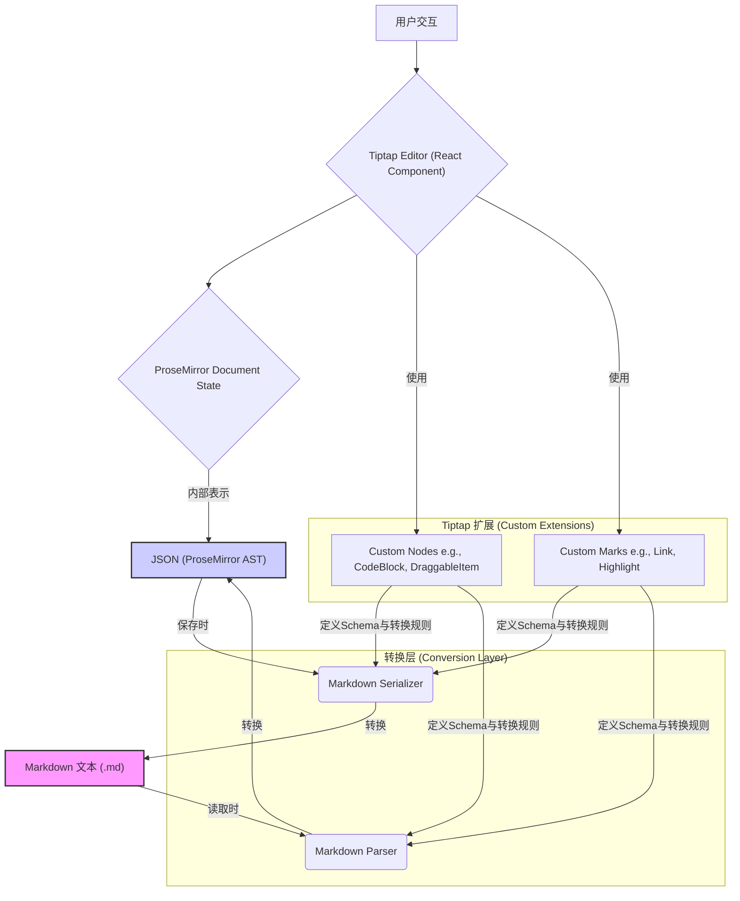

Now-Noting 的编辑器采用 Tiptap 作为核心，旨在提供类似 Notion 的“块编辑”体验，同时确保与 Markdown 格式的双向兼容性。这种设计需要一个精巧的转换层，以在 Tiptap 内部基于 JSON 的文档模型和纯文本的 Markdown 之间进行精确映射。本文档旨在深入解析该编辑器的架构，重点阐述自定义 Tiptap 扩展（Extensions）的实现，以及在存储和读取时发生的 Markdown 序列化与解析机制。

## 架构概览：基于 Tiptap 和 ProseMirror 的扩展体系

Now-Noting 编辑器的基础是 Tiptap，一个基于 ProseMirror 的无头（Headless）编辑器框架。ProseMirror 为结构化内容提供了强大的底层模型，而 Tiptap 则在此之上提供了一套更易于扩展和集成的 API，尤其适合与 React 等现代前端框架结合。编辑器功能的实现并非通过直接操作 DOM，而是通过定义一系列“节点”（Nodes）和“标记”（Marks）来构建一个严格的文档结构（Schema）。

系统的核心挑战在于弥合 Tiptap 的 JSON 格式（ProseMirror 的内部状态）与 Markdown 之间的差异。为解决此问题，我们构建了一个包含转换逻辑的适配器层。该架构确保了用户在享受所见即所得（WYSIWYG）编辑体验的同时，底层数据能够以可移植性强的 Markdown 格式进行持久化存储。



此图展示了数据流：
1.  **编辑时**：用户在 Tiptap 编辑器中操作，所有更改都实时反映在 ProseMirror 的 JSON 文档状态中。
2.  **保存时**：`Markdown Serializer` 遍历 JSON 结构，根据每个节点和标记的 `toMarkdown` 规则，将其转换为 Markdown 文本字符串。
3.  **加载时**：`Markdown Parser` 读取 Markdown 文本，根据 `parseMarkdown` 规则，将其解析回 Tiptap/ProseMirror 能理解的 JSON 文档结构。

这个双向转换机制是实现“源码模式”和数据持久化的关键。

Sources: [frontend/src/hooks/useEditor.ts](frontend/src/hooks/useEditor.ts#L46-L101)

## 自定义 Tiptap 扩展

为了实现特定的编辑功能和 UI 效果，Now-Noting 对 Tiptap 的原生节点进行了扩展和定制。这些扩展不仅定义了节点的渲染方式，更重要的是，它们包含了与 Markdown 进行双向绑定的核心逻辑。所有自定义扩展都集中在 `frontend/src/components/editor/extensions` 目录中。

一个典型的自定义节点（例如 `CodeBlock`）遵循以下设计模式：
1.  **Schema 定义**：使用 `Node.create` 方法定义节点的名称、属性（如 `language`）和内容模型。
2.  **渲染逻辑**：通过 `addNodeView` 方法，使用 React 组件 (`CodeBlockView.tsx`) 来完全接管节点的渲染，从而实现复杂的交互，如语言选择下拉菜单和一键复制功能。
3.  **Markdown 转换**：
    *   `toMarkdown`：定义如何将此节点的 JSON 表示序列化为 Markdown。对于代码块，这意味着生成被三个反引号包围并带有语言标识符的代码块语法。
    *   `parseMarkdown`：定义如何从 Markdown Token 中识别并解析出此节点。解析器会寻找 `fence` 类型的 Token，并将其转换为 `CodeBlock` 节点的 JSON 结构。

```typescript
// frontend/src/components/editor/extensions/CodeBlock.ts

// 伪代码示例，展示关键配置
export const CodeBlock = Node.create({
  name: 'codeBlock',
  // ... 其他属性
  
  addAttributes() {
    return {
      language: {
        default: null,
        // ...
      },
    };
  },

  // 关键：使用 React 组件进行渲染
  addNodeView() {
    return ReactNodeViewRenderer(CodeBlockView);
  },

  // 关键：定义 Markdown 序列化规则
  addStorage() {
    return {
      toMarkdown: {
        // ...
      },
      // 关键：定义 Markdown 解析规则
      parseMarkdown: {
        // ...
      },
    };
  },
});
```

除了 `CodeBlock`，`DraggableItem` 是另一个核心扩展，它为所有块级元素包裹了一层可拖拽的手柄，实现了类似 Notion 的拖放排序功能。这个扩展通过修改其他节点的渲染方式，巧妙地将拖拽功能注入到编辑器中，而无需为每个节点单独实现。

Sources: [frontend/src/components/editor/extensions/CodeBlock.ts](frontend/src/components/editor/extensions/CodeBlock.ts#L1-L245), [frontend/src/components/editor/extensions/DraggableItem.tsx](frontend/src/components/editor/extensions/DraggableItem.tsx#L1-L41)

## Markdown 序列化与解析

Markdown 与 Tiptap JSON 之间的转换并非由 Tiptap 直接提供，而是通过一个专门的库 `tiptap-markdown` 来实现的。`useEditor` 这个 React Hook 是整个机制的编排中心，它负责初始化 Tiptar 编辑器实例，并注入所有必需的扩展。

在 `useEditor.ts` 中，`TiptapMarkdown` 扩展被添加到扩展列表中。这个扩展在内部使用了 `markdown-it` 进行 Markdown 解析，并实现了一套遍历 Tiptap AST 进行序列化的逻辑。我们在创建 `TiptapMarkdown` 实例时，会传入 `content`（Markdown 文本），它会在编辑器初始化时自动完成 `Markdown -> JSON` 的转换。

```typescript
// frontend/src/hooks/useEditor.ts
// ...
export const useEditor = ({
  // ...
  content,
  onUpdate,
  onSave,
}: UseEditorProps) => {
  const editor = useTiptapEditor({
    extensions: [
      // ... 其他扩展
      TiptapMarkdown.configure({
        // 关键：当内容变化时，触发 toMarkdown 转换
        html: false, 
        bulletListMarker: '-',
        tightLists: true,
        // 监听更新事件，并将转换后的 Markdown 传递出去
        onBeforeCreate: ({ editor }) => {
          editor.storage.markdown.getMarkdown(); 
        },
        onUpdate: ({ editor }) => {
          onUpdate(editor.storage.markdown.getMarkdown());
        },
        // ...
      }),
      // ...
    ],
    // 关键：初始化时加载的 Markdown 内容
    content: content, 
    // ...
  });
  // ...
}
```

当笔记需要保存时，`editor.storage.markdown.getMarkdown()` 方法被调用。此方法会触发序列化过程：遍历当前编辑器的 JSON 文档树，并调用在每个节点扩展（如 `CodeBlock.ts`）中定义的 `toMarkdown` 规则，最终拼接成一个完整的 Markdown 字符串。这一精心设计的流程确保了无论用户在富文本视图中进行了多么复杂的操作，最终都能可靠地转换为干净、标准的 Markdown 文本。