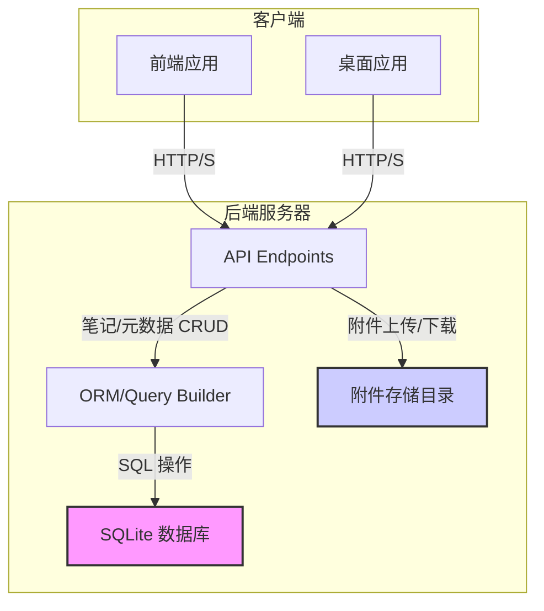

Now-Noting 的核心功能之一是确保用户数据在不同设备间的可靠同步与安全存储。为了实现这一目标，系统采用了一种结合了关系型数据库和文件系统存储的混合策略。本文将深入解析系统的持久化层，阐明其如何管理笔记、附件及元数据，并最终实现高效的数据同步。

## 核心架构：SQLite 与文件系统的协同

系统的数据持久化架构可以分为两个主要部分：

1.  **数据库 (SQLite)**: 用于存储结构化的文本内容和元数据，如笔记、标签、用户信息等。SQLite 是一个轻量级的嵌入式数据库，它将整个数据库存储为单个文件，极大地简化了部署和备份过程。
2.  **文件系统**: 用于存储二进制数据，主要是笔记中的附件，如图片、文档和其他文件。将这些较大的文件存储在文件系统而不是数据库中，可以避免数据库文件膨胀，保持查询性能。

这两种策略协同工作，形成了一个高效、易于管理的持久化方案。



如上图所示，所有客户端通过 API 与后端交互。后端服务根据请求类型，分别通过 ORM (Object-Relational Mapping) 操作 SQLite 数据库，或直接读写文件系统中的附件。

Sources: [backend/src/db/index.ts](backend/src/db/index.ts#L36-L55)

## 数据库管理：Kysely 与迁移机制

为了与 SQLite 数据库进行高效且类型安全的交互，项目选用了 [Kysely](https://kysely.dev/) 作为一个现代化的 TypeScript SQL 查询构建器。Kysely 能够根据数据库 schema 自动推断查询结果的类型，从而在开发阶段就能捕捉到潜在的 SQL 错误，显著提升了代码的健壮性。

### 数据库初始化与迁移

数据库的初始化和结构演进是通过一个内置的迁移系统来管理的。该系统位于 `backend/src/db/migrations` 目录下，确保了数据库模式在版本迭代过程中的一致性。

-   **初始化**: 当应用首次启动时，它会检查数据库文件是否存在。如果不存在，它将运行 `Kysely` 的迁移工具，应用所有定义好的迁移脚本，创建初始的表结构。
-   **迁移**: 每当数据库结构需要变更（例如，添加新表或修改字段），开发者会创建一个新的迁移文件。应用启动时会自动检测并执行所有尚未应用的迁移，从而使数据库结构与最新的代码保持同步。

```typescript
// backend/src/db/index.ts
// ...
const migrator = new Migrator({
  db: dbInstance,
  provider: new FileMigrationProvider({
    fs,
    path,
    migrationFolder: path.join(__dirname, 'migrations'),
  }),
});

const { error, results } = await migrator.migrateToLatest();
// ...
```

这种机制保证了无论是新部署还是旧版本升级，数据库都能平滑地过渡到正确的状态。

Sources: [backend/src/db/index.ts](backend/src/db/index.ts#L29-L43), [backend/package.json](backend/package.json#L24-L24)

## 附件管理：存储与路由

附件管理是持久化策略的另一半。所有非文本数据都被作为附件处理，存储在服务器的文件系统中。

### 存储位置

附件的存储路径由环境变量 `DATA_PATH` 决定。默认情况下，附件被存储在应用数据目录下的 `files` 子目录中。这种设计将用户数据（数据库和附件）集中存放，便于用户进行统一的备份和迁移。

### 附件路由

系统通过专门的 API 路由来处理附件的上传和访问。

1.  **上传 (`POST /api/files/upload`)**: 当用户上传文件时，后端服务会验证文件类型和大小，然后生成一个唯一的文件名（通常是 UUID 加上原始扩展名），最后将其保存到附件存储目录。
2.  **访问 (`GET /api/files/:filename`)**: 当客户端需要显示或下载附件时，它会请求此路由。后端服务会根据提供的文件名在附件目录中查找文件，并通过 `fastify-static` 插件将其作为静态资源响应给客户端。

这种将附件服务化的做法，将文件存储的实现细节与前端完全解耦。

Sources: [backend/src/routes/file.ts](backend/src/routes/file.ts#L8-L29)

## 数据同步：以 API 为中心

Now-Noting 的数据同步模型本质上是一个标准的客户端-服务器（Client-Server）模型。客户端（Web、桌面、移动端）并不直接交互，而是通过向中心化的后端服务请求数据来保持同步。

-   **拉取数据**: 客户端启动或定期轮询时，会向后端请求最新的笔记列表和内容。
-   **推送数据**: 当用户在客户端创建或修改笔记时，应用会向后端发送 `POST` 或 `PUT` 请求，将变更持久化到服务器的数据库中。

由于所有数据都以服务器为唯一真实来源（Single Source of Truth），只要客户端能够连接到服务器，就能获取到最新版本的数据，从而实现了跨平台的同步。

---

通过对数据持久化与同步机制的了解，您可以进一步探索系统的其他核心模块。例如，了解数据是如何被安全保护的，可以阅读 [用户认证：JWT 与中间件实现](12-yong-hu-ren-zheng-jwt-yu-zhong-jian-jian-shi-xian)，或者研究 [编辑器核心：Tiptap 扩展与 Markdown 转换](10-bian-ji-qi-he-xin-tiptap-kuo-zhan-yu-markdown-zhuan-huan) 来理解笔记内容是如何被处理的。