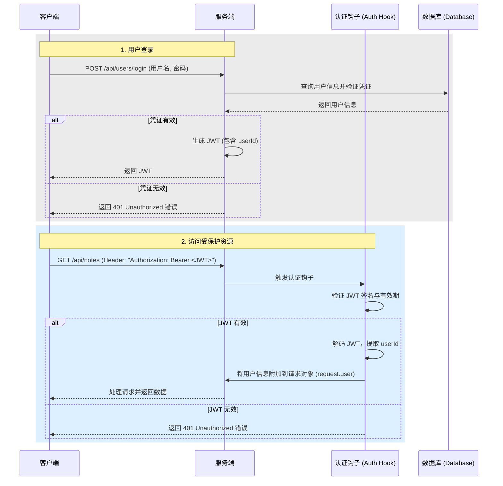

在 Now-Noting 应用中，用户认证是保障数据安全的核心机制。系统采用 JSON Web Tokens (JWT) 来管理用户会话，并通过在 Fastify 框架中注册中间件（在 Fastify 中称为 "Hooks"）来保护需要认证的 API 路由。这种无状态的认证模式简化了服务端的会话管理，提高了系统的可伸缩性。

Sources: [backend/src/middleware/auth.ts](backend/src/middleware/auth.ts#L11-L47)

## 认证流程架构

Now-Noting 的认证流程遵循标准的 JWT 模式。它始于用户登录，终于服务器对后续每个请求的令牌验证。所有受保护的路由都必须经过一个认证钩子（Hook），该钩子负责解析和验证请求头中的 JWT。

以下是整个认证生命周期的架构图：



这个流程清晰地展示了登录和受保护资源访问两个关键阶段。一旦登录成功，客户端的每次请求都会携带 JWT，由服务端的认证钩子进行统一验证，实现了对 API 接口的安全访问控制。

Sources: [backend/src/routes/user.ts](backend/src/routes/user.ts#L33-L73), [backend/src/middleware/auth.ts](backend/src/middleware/auth.ts#L11-L47)

## JWT 生成与验证

JWT 的生命周期管理是认证系统的核心。在 Now-Noting 中，这包括在用户成功登录时生成令牌，以及在后续请求中验证令牌的合法性。

### 令牌生成

当用户通过 `/api/users/login` 路由成功登录后，服务端会调用 `fastify.jwt.sign` 方法来创建一个新的 JWT。这个令牌的载荷（Payload）中包含了用户的唯一标识符 `id`，并设置了一个固定的过期时间。

-   **载荷 (Payload)**: `{ id: user.id }` - 这是识别用户身份的关键信息。
-   **过期时间 (Expires In)**: `365d` - 令牌被设置为一年后过期，这是一种长效会话策略，适用于桌面和移动笔记应用场景。

```typescript
// backend/src/routes/user.ts
// ...
// 签发 JWT
const token = fastify.jwt.sign({ id: user.id }, {
  expiresIn: '365d',
});
// ...
```

这种设计将用户身份信息安全地封装在客户端，服务端无需存储任何会话状态。

Sources: [backend/src/routes/user.ts](backend/src/routes/user.ts#L55-L58)

### 认证钩子实现

为了保护需要用户登录才能访问的路由，系统实现了一个名为 `authenticate` 的钩子函数。这个函数利用 Fastify 的 `onRequest` 生命周期，在请求到达路由处理器之前执行。它通过 `request.jwtVerify()` 方法自动完成 JWT 的解析和验证。

该函数的具体步骤如下：
1.  **提取令牌**: `request.jwtVerify()` 会自动从 `Authorization` 请求头中提取 `Bearer` 类型的令牌。
2.  **验证签名和时效**: 它会使用在插件中配置的 `JWT_SECRET` 来验证令牌的签名是否有效，并检查令牌是否已过期。
3.  **附加用户信息**: 如果验证成功，解码后的载荷（即 `{ id: user.id, iat: ..., exp: ... }`）会被附加到 `request.user` 对象上，供后续的业务逻辑使用。
4.  **处理异常**: 如果令牌缺失、格式错误、签名无效或已过期，函数会捕获异常并向客户端返回 `401 Unauthorized` 错误，从而中断请求。

```typescript
// backend/src/middleware/auth.ts
export async function authenticate(request: FastifyRequest, reply: FastifyReply) {
  try {
    await request.jwtVerify();
  } catch (err) {
    reply.send(err);
  }
}
```

这个钩子是声明式地应用于需要保护的路由上的，通过在路由选项中指定 `onRequest: [authenticate]` 来启用。

Sources: [backend/src/middleware/auth.ts](backend/src/middleware/auth.ts#L11-L19)

## 插件集成与路由保护

认证功能并非凭空存在，而是通过 Fastify 的插件系统集成到应用中的。`@fastify/jwt` 插件负责提供 JWT 的核心能力，而自定义的 `authenticate` 钩子则提供了具体的认证逻辑。

### JWT 插件注册

在 `backend/src/plugins/auth.ts` 文件中，系统注册了 `@fastify/jwt` 插件。在注册时，必须提供一个密钥 `secret`，它从环境变量 `JWT_SECRET` 中读取。这个密钥至关重要，因为它被用来对 JWT 进行签名和验证，确保了令牌的不可伪造性。

```typescript
// backend/src/plugins/auth.ts
import fp from 'fastify-plugin';
import fastifyJwt from '@fastify/jwt';
import { FastifyReply, FastifyRequest } from 'fastify';

export default fp(async (fastify) => {
  fastify.register(fastifyJwt, {
    secret: process.env.JWT_SECRET || 'a-very-secret-key-that-is-at-least-32-chars-long',
    // ...
  });
});
```

同时，该插件还通过 `fastify.decorate` 扩展了 `FastifyInstance`，添加了 `authenticate` 装饰器，使得认证钩子可以在整个应用中被方便地引用。

Sources: [backend/src/plugins/auth.ts](backend/src/plugins/auth.ts#L6-L19)

### 在路由中应用认证

注册了认证钩子后，保护一个路由变得非常简单。只需在该路由的配置对象中添加 `onRequest` 属性，并传入 `authenticate` 函数即可。Fastify 会确保在执行该路由的处理器 `handler` 之前，先执行 `onRequest` 数组中的所有钩子。

以下是保护 `/api/me` 路由的示例，该路由用于获取当前登录用户的信息。

```typescript
// backend/src/routes/user.ts
fastify.get('/api/me', {
  onRequest: [fastify.authenticate], // 应用认证钩子
  async handler(request, reply) {
    const userId = request.user.id; // 从 request.user 中安全地获取 userId
    const user = await fastify.userService.getUserById(userId);
    // ...
  },
});
```

通过这种方式，开发人员可以清晰地控制哪些 API 端点是公开的，哪些是需要用户认证后才能访问的，实现了灵活且安全的访问控制策略。