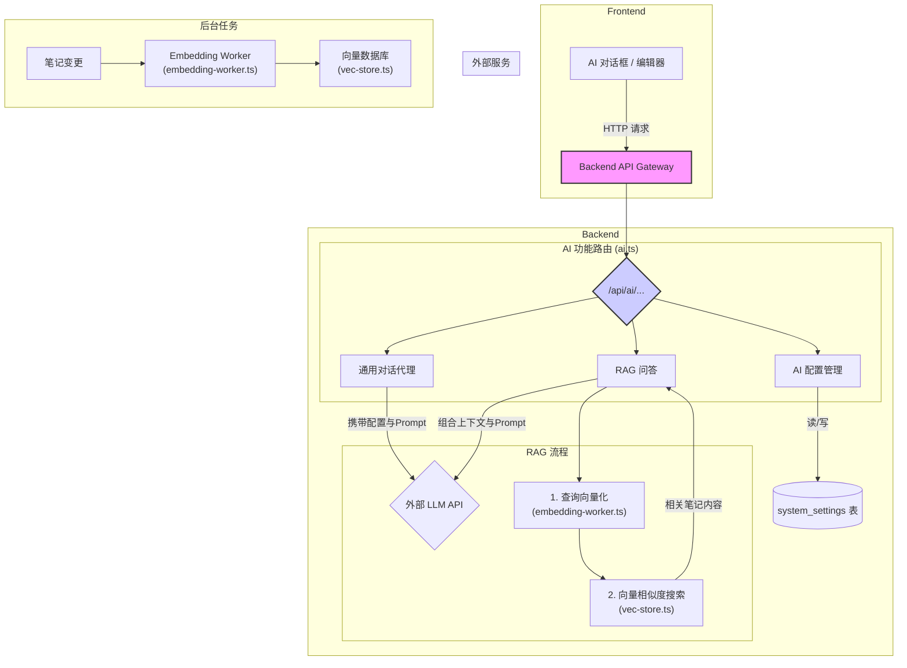
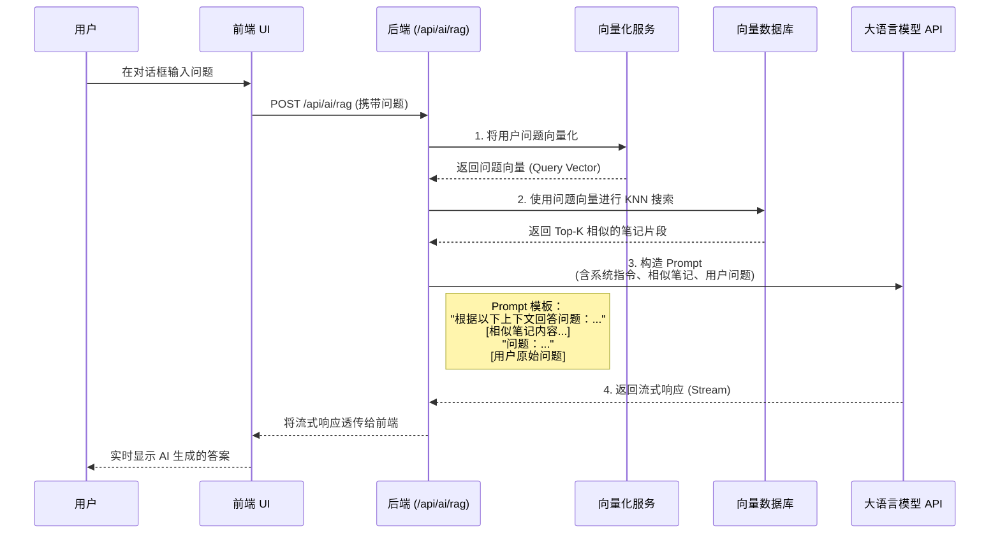

Now-Noting 通过后端服务与多种大语言模型（LLM）API 进行集成，为用户提供智能对话、文本处理和知识库问答等功能。该集成架构的核心在于其灵活性和可扩展性，支持多种 AI 服务提供商，并实现了基于笔记内容的检索增强生成（RAG）能力。

## 1. 整体架构概览

系统的 AI 功能分为两个主要部分：**通用对话代理**和**检索增强生成 (RAG) 流程**。前者负责直接与外部 LLM API 通信，后者则通过向量化笔记内容，为 LLM 提供与用户知识库相关的上下文，实现更精准的问答。所有 AI 相关的配置都存储在数据库的 `system_settings` 表中，并通过统一的后端路由进行管理。

以下是 AI 功能的整体架构图：

这个架构清晰地分离了不同的关注点：前端负责用户交互，后端路由负责业务逻辑协调，而具体的 AI 能力（如向量生成、相似度搜索）则被封装在独立的服务模块中。

Sources: [backend/src/routes/ai.ts](backend/src/routes/ai.ts#L1-L2084)

## 2. AI 服务配置管理

为了适应不同的使用场景和偏好，系统支持接入多个主流的 AI 服务提供商。用户可以在设置界面配置 API 的关键信息，后端服务将这些信息持久化到数据库中，并在与 LLM 交互时动态加载。

### 2.1 配置参数

系统通过 `AISettings` 接口统一定义了所有 AI 相关的配置项。这套配置不仅包括对话模型，还独立定义了用于 RAG 的 Embedding 模型，提供了更高的灵活性。

| 参数名 | 类型 | 描述 | 支持的 Provider |
| :--- | :--- | :--- | :--- |
| `ai_provider` | `string` | AI 服务提供商标识符 | `openai`, `ollama`, `qwen`, `deepseek`, `gemini`, `doubao`, `custom` |
| `ai_api_url` | `string` | 对话模型的 API 端点 URL | - |
| `ai_api_key` | `string` | 对话模型的 API 密钥 | 除 `ollama` 外都需要 |
| `ai_model` | `string` | 对话模型的具体名称 (e.g., `gpt-4o-mini`) | - |
| `ai_embedding_url` | `string` | (可选) Embedding 模型的 API 端点。若留空，则回退使用 `ai_api_url` | - |
| `ai_embedding_key` | `string` | (可选) Embedding 模型的 API 密钥。若留空，则回退使用 `ai_api_key` | - |
| `ai_embedding_model`| `string` | (可选) Embedding 模型的具体名称 (e.g., `text-embedding-3-small`)。若留空，RAG 功能将不可用 | - |

这些配置通过后端的 `/api/ai/settings` 路由进行读写操作。GET 请求用于获取当前配置（API 密钥会被打码以确保安全），PUT 请求用于更新配置。所有配置项都存储在 `system_settings` 表中，键名以 `ai_` 为前缀。

Sources: [backend/src/routes/ai.ts](backend/src/routes/ai.ts#L58-L160)

### 2.2 连接测试

为了验证用户配置的有效性，后端提供了 `/api/ai/test` 接口。它会使用当前存储的 `ai_api_url`、`ai_api_key` 和 `ai_model` 等信息，向目标服务的 `/chat/completions` 端点发送一个简单的 `Hi` 消息。该请求设置了 15 秒的超时。如果测试成功，说明配置无误；否则将返回具体的错误信息。特别地，对于 Ollama，如果标准 OpenAI 兼容接口测试失败，系统会尝试调用其原生的 `/api/tags` 接口作为回退测试，以提高兼容性。

Sources: [backend/src/routes/ai.ts](backend/src/routes/ai.ts#L163-L225)

## 3. 核心交互流程

系统与 LLM 的交互主要通过两个 API 端点实现：`/api/ai/chat` 用于无上下文的通用对话，而 `/api/ai/rag` 则实现了集成知识库的问答能力。两者都支持流式响应（Streaming），以提供更流畅的用户体验。

### 3.1 通用对话 (`/api/ai/chat`)

此端点作为一个代理，将前端发送的对话历史和用户新消息转发给配置好的 LLM API。它不涉及任何知识库内容，适用于快速问答、文本翻译、创意生成等通用场景。后端从数据库加载 AI 配置，构造符合目标服务要求的请求体，然后将 LLM 的流式响应直接透传给前端。

### 3.2 检索增强生成 (RAG) (`/api/ai/rag`)

RAG 是 Now-Noting AI 功能的核心，它让 LLM 能够“阅读”用户的笔记并据此回答问题。该流程严格遵循“先检索、后生成”的模式，并通过 `resolveScope` 函数确保用户只能在授权的知识空间（个人空间或所在工作区）内进行检索，保障了数据隔离。

RAG 的工作流程如下：

1.  **查询向量化**：当后端收到 RAG 请求时，首先调用 `embedding-worker` 服务，使用与笔记内容相同的 Embedding 模型将用户的问题转换成一个向量。
2.  **相似度搜索**：后端拿着问题向量，在 `vec-store`（向量数据库）中执行 k-最近邻（KNN）搜索，找出内容最相关的笔记片段作为上下文。
3.  **上下文注入与生成**：后端将检索到的笔记片段与用户的原始问题组合成一个结构化的 Prompt，发送给 LLM。这个 Prompt 指导模型必须基于提供的上下文来回答问题。
4.  **流式响应**：LLM 生成的答案以数据流的形式返回，后端将其直接转发给前端，实现了打字机般的实时显示效果。

这个流程确保了 AI 的回答不仅限于其通用训练数据，而是与用户自己的知识库紧密相关，显著提高了问答的准确性和相关性。

Sources: [backend/src/routes/ai.ts](backend/src/routes/ai.ts#L481-L572)

## 下一步

-   要了解前端如何构建 AI 对话界面并与这些后端 API 交互，请查阅 [前端架构：基于 React 和 Capacitor 的跨平台 UI](8-qian-duan-jia-gou-ji-yu-react-he-capacitor-de-kua-ping-tai-ui)。
-   要深入探究笔记内容是如何被自动处理成向量并存储的，请参考 [数据同步与持久化：数据库与附件管理](11-shu-ju-tong-bu-yu-chi-jiu-hua-shu-ju-ku-yu-fu-jian-guan-li)。