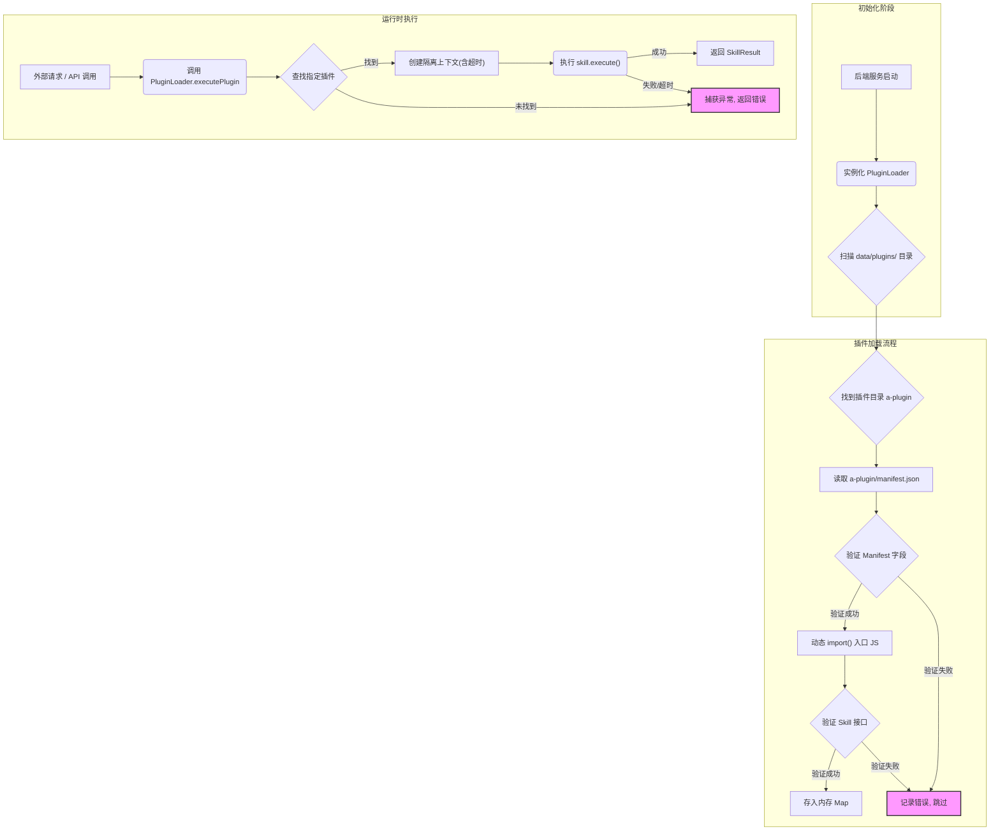

Now-Noting 的核心设计理念之一是可扩展性。为了在不修改核心代码库的前提下，安全、便捷地增强应用功能，我们引入了一套基于后端的插件系统。该系统允许开发者创建独立的插件模块（称为 "Skill"），动态加载并执行，从而为笔记应用增加诸如第三方服务集成、自定义文本处理、自动化工作流等高级能力。

本文档旨在解析插件系统的架构、核心概念和工作流程，为希望开发或理解 Now-Noting 插件的开发者提供技术指引。

## 架构概览：动态加载与隔离执行

插件系统的架构建立在 Node.js 后端之上，其核心是 `PluginLoader` 类。它负责从指定目录（默认为 `data/plugins/`）动态扫描、加载、管理和执行插件。该设计遵循了几个关键原则：

*   **约定优于配置**：每个插件必须是一个包含 `manifest.json` 描述文件和 JavaScript 入口模块的目录。
*   **动态加载**：系统在启动时自动发现并加载所有合法插件，无需重启服务即可通过接口重新加载或卸载。
*   **安全隔离**：插件在独立的上下文中执行，并通过超时控制和路径限制来防止恶意或有缺陷的插件影响整个应用的稳定性。
*   **能力声明**：插件必须在 `manifest.json` 中明确声明其提供的能力（`capabilities`），方便系统索引和调用。

下面的 Mermaid 图展示了插件加载和执行的完整生命周期。


Sources: [backend/src/plugins/plugin-loader.ts](backend/src/plugins/plugin-loader.ts#L85-L134), [backend/src/plugins/plugin-loader.ts](backend/src/plugins/plugin-loader.ts#L266-L304)

## 核心接口与数据结构

为了实现标准化和互操作性，插件系统定义了一系列 TypeScript 接口。理解这些接口是开发插件的第一步。

### `NowenSkill`：插件的执行实体

`NowenSkill` 是任何插件都必须实现的接口，它定义了插件的生命周期和执行逻辑。一个最小化的插件就是一个导出了符合此接口的默认对象的模块。

| 方法/属性 | 类型 | 描述 | 是否必须 |
| :--- | :--- | :--- | :--- |
| `name` | `string` | 插件的唯一名称，应与 `manifest.json` 中一致。 | 是 |
| `version` | `string` | 插件的版本号，遵循语义化版本。 | 是 |
| `description` | `string` | 插件功能的简要描述。 | 是 |
| `capabilities` | `SkillCapability[]` | 声明此插件提供的所有能力。 | 是 |
| `execute()` | `Promise<SkillResult>` | 插件的核心执行函数，处理输入并返回结果。 | 是 |
| `init()` | `Promise<void>` | 初始化函数，在插件被加载时调用，用于准备资源。 | 否 |
| `destroy()` | `Promise<void>` | 销毁函数，在插件被卸载时调用，用于清理资源。 | 否 |

Sources: [backend/src/plugins/plugin-loader.ts](backend/src/plugins/plugin-loader.ts#L53-L62)

### `SkillManifest`：插件的身份清单

每个插件目录的根目录下都必须包含一个 `manifest.json` 文件，其内容对应 `SkillManifest` 接口。它向系统声明了插件的元数据、入口文件和所需能力，是插件被正确识别和加载的基础。

| 字段 | 类型 | 描述 | 是否必须 |
| :--- | :--- | :--- | :--- |
| `name` | `string` | 插件的唯一名称。 | 是 |
| `version` | `string` | 插件的版本号。 | 是 |
| `description` | `string` | 插件功能的描述。 | 是 |
| `author` | `string` | 插件作者。 | 是 |
| `main` | `string` | 插件的 JS/MJS 入口文件路径（相对于 `manifest.json`）。 | 是 |
| `capabilities` | `SkillCapability[]` | 插件提供的能力列表。 | 是 |
| `permissions` | `string[]` | （未来规划）声明插件需要的权限，如网络访问、文件读写等。 | 否 |

Sources: [backend/src/plugins/plugin-loader.ts](backend/src/plugins/plugin-loader.ts#L64-L72), [backend/src/plugins/plugin-loader.ts](backend/src/plugins/plugin-loader.ts#L137-L145)

### `SkillCapability` 与 `SkillContext`：定义能力与上下文

`SkillCapability` 接口用于精确描述插件能做什么，而 `SkillContext` 则为插件执行时提供了必要的环境信息和工具。

*   **`SkillCapability`**：定义了一个插件可以执行的具体 "动作" (`action`)。它描述了这个动作的输入输出类型以及可配置的参数 (`params`)。这使得系统可以根据 `action` 名称来查找并调用特定插件的功能。
*   **`SkillContext`**：在 `execute` 方法被调用时，系统会传入一个上下文对象。它包含了用户 ID (`userId`)、API 基础 URL 和令牌，以及一个日志记录函数 (`log`)。这确保了插件可以在正确的用户权限下运行，并能与其他 API 进行安全交互。

```typescript
// SkillCapability 定义了一个插件可以执行的具体动作
export interface SkillCapability {
  action: string;       // 动作的唯一标识，例如 "summarize-text"
  description: string;  // 动作功能的描述
  inputTypes: string[]; // 允许的输入数据类型
  outputTypes: string[];// 可能的输出数据类型
  params?: SkillParam[];// 用户可配置的参数
}

// SkillContext 为插件执行提供了环境信息
export interface SkillContext {
  log: (message: string) => void; // 用于记录插件执行日志
  userId: string;                 // 当前操作用户的 ID
  apiBaseUrl: string;             // 用于调用内部 API 的基础 URL
  apiToken: string;               // 用于 API 调用的认证令牌
}
```
Sources: [backend/src/plugins/plugin-loader.ts](backend/src/plugins/plugin-loader.ts#L21-L27), [backend/src/plugins/plugin-loader.ts](backend/src/plugins/plugin-loader.ts#L38-L44)

## 工作流程详解

### 插件的加载与热重载

`PluginLoader` 通过 `loadAll()` 方法启动加载流程。它会遍历插件目录，对每个子目录执行 `loadPlugin()`。加载过程中会进行严格的校验，包括 `manifest.json` 的存在性与完整性、入口文件的路径安全性（防止目录遍历攻击），以及最终模块是否符合 `NowenSkill` 接口规范。如果一个已加载的插件被重新加载，系统会先尝试调用其 `destroy()` 方法以释放旧资源，再加载新版本，从而实现一定程度的热重载。

Sources: [backend/src/plugins/plugin-loader.ts](backend/src/plugins/plugin-loader.ts#L109-L134), [backend/src/plugins/plugin-loader.ts](backend/src/plugins/plugin-loader.ts#L136-L203)

### 插件的执行与安全沙箱

当需要执行一个插件的功能时，外部服务会调用 `PluginLoader.executePlugin()`。该方法不仅负责传递参数和上下文，还构建了一个关键的安全沙箱：

1.  **超时控制**：通过 `Promise.race` 实现了一个可配置的执行超时（默认为 30 秒）。如果插件执行时间过长，将被强制终止并返回超时错误，防止单个插件阻塞服务。
2.  **错误隔离**：`execute` 方法被包裹在 `try...catch` 块中。任何在插件内部抛出的异常都会被捕获，并作为标准 `SkillResult` 对象的一部分返回，而不会导致后端服务崩溃。
3.  **日志记录**：`SkillContext` 中提供的 `log` 函数会将日志暂存。无论执行成功与否，日志都会被 `PluginLoader` 统一收集和管理，便于事后调试和审计。

这种设计确保了插件的执行过程是受控且可靠的，即使是第三方开发的插件，也能在不牺牲系统稳定性的前提下安全运行。