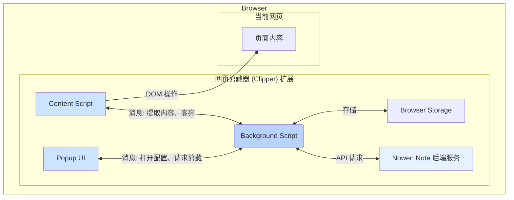
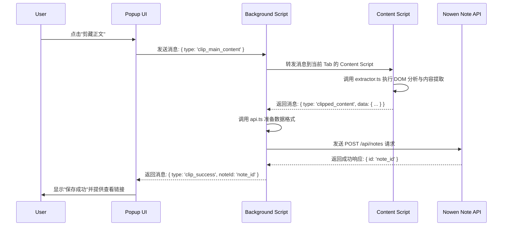

Nowen Note 的网页剪藏器是一个浏览器扩展，旨在帮助用户快速捕获、标注和保存网页内容。它作为独立的功能模块存在于 `packages/nowen-clipper` 目录中，通过标准 Web Extension API 实现，可以打包为适用于主流浏览器的扩展程序。本文档将深入解析剪藏器的架构设计、核心工作流程以及关键技术实现，为二次开发或技术研究提供参考。

## 架构概览

剪藏器遵循现代浏览器扩展的标准三层架构：**Popup**、**Content Script** 和 **Background Script**。这种分离式设计确保了职责清晰和高效通信：**Popup** 提供用户交互界面，**Content Script** 负责与网页内容直接交互，而 **Background Script** 则作为中央协调器处理后台任务和状态管理。



- **Popup UI (`popup/`)**: 用户点击浏览器工具栏图标时显示的界面。它负责呈现剪藏选项（如剪藏全文、选区、截图等），并向 Background Script 发送用户指令。
- **Content Script (`content/`)**: 被注入到当前网页的脚本。它拥有访问和操作页面 DOM 的能力，用于执行核心的文本提取、DOM 清理和高亮显示等任务。
- **Background Script (`background/`)**: 扩展的常驻后台进程。它处理所有核心业务逻辑，包括监听来自 Popup 和 Content Script 的消息、维护扩展状态（如用户认证信息）、调用 Nowen Note 后端 API 保存笔记，并协调不同组件间的通信。

这种架构通过明确的职责划分，将 UI、内容处理和后台服务调用解耦，使得系统易于维护和扩展。

Sources: [packages/nowen-clipper/src/](packages/nowen-clipper/src#L1-L18)

## 核心工作流程

网页剪藏的核心流程始于用户在 Popup 界面的操作，经过 Background 和 Content 脚本的协同处理，最终将内容保存到用户的笔记库中。



1.  **用户触发**: 用户在 Popup 界面点击剪藏按钮，例如“剪藏正文”。
2.  **指令传递**: Popup 脚本捕获该事件，并向 Background Script 发送一个包含剪藏类型的消息。
3.  **任务分发**: Background Script 接收到消息后，将其转发给当前活动标签页的 Content Script。
4.  **内容提取**: Content Script 调用 `extractor.ts` 模块，该模块使用 [Readability.js](https://github.com/mozilla/readability) 库对网页 DOM 进行分析，提取出主要内容、标题和元数据，并进行必要的 HTML 清理。
5.  **数据回传**: Content Script 将提取并处理干净的 HTML 内容和文章信息回传给 Background Script。
6.  **保存笔记**: Background Script 调用 `api.ts` 模块，将收到的内容组织成符合后端要求的格式，并通过 `fetch` 请求将其发送到 Nowen Note 后端的笔记创建接口。
7.  **结果反馈**: 后端保存成功后，Background Script 会收到确认。它可以选择性地通知 Popup 或通过桌面通知告知用户剪藏已完成。

这个流程清晰地展示了各组件如何通过消息传递机制进行协作，完成了从前端内容抓取到后端数据持久化的完整闭环。

Sources: [packages/nowen-clipper/src/lib/extractor.ts](packages/nowen-clipper/src/lib/extractor.ts#L33-L44), [packages/nowen-clipper/src/lib/api.ts](packages/nowen-clipper/src/lib/api.ts#L61-L82)

## 组件通信机制

剪藏器内部各组件（Popup, Background, Content）之间的通信完全基于浏览器提供的 `chrome.runtime.sendMessage` 和 `chrome.tabs.sendMessage` API。项目在 `src/lib/protocol.ts` 文件中定义了统一的消息协议，以确保通信的类型安全和一致性。

### 消息协议

所有消息都遵循一个基础结构，包含 `type` 字段用于区分消息类型，以及一个可选的 `data` 字段用于承载数据。

```typescript
// 示例消息定义
export interface ClipMessage {
  type: 'clip_main_content' | 'clip_selection' | 'clip_full_page'
}

export interface ClippedContentMessage {
  type: 'clipped_content'
  data: {
    title: string
    content: string // HTML 格式
    url: string
  }
}
```

这种做法使得消息意图一目了然，并且利用 TypeScript 的类型系统，可以在编译时就发现潜在的通信错误，极大地提高了代码的健壮性。

### 通信场景

- **Popup → Background**: 直接使用 `chrome.runtime.sendMessage`。通常用于发送用户指令，如请求剪藏、打开选项页或获取配置信息。
- **Background → Content**: 需要指定目标标签页，使用 `chrome.tabs.sendMessage(tabId, message)`。用于指示 Content Script 开始执行 DOM 操作。
- **Content → Background**: 直接使用 `chrome.runtime.sendMessage`。用于回传从页面提取的数据或操作结果。

通过在 `protocol.ts` 中集中管理所有消息类型，开发者可以快速了解系统支持的所有交互行为，降低了维护和扩展新功能的难度。

Sources: [packages/nowen-clipper/src/lib/protocol.ts](packages/nowen-clipper/src/lib/protocol.ts#L1-L26)

## 构建与打包

剪藏器作为一个标准的 Web 项目，使用 Vite 进行开发和构建。打包过程被封装在 `scripts/` 目录下的 Node.js 脚本中，自动化了从代码编译到生成最终 `.zip` 压缩包的全部流程。

构建流程的核心步骤如下：
1.  **Vite 构建**: `vite build` 命令会分别编译 Popup, Options, Content 和 Background 的 TypeScript 代码，并处理相关的 HTML 和 CSS 资源。输出位于 `dist/` 目录。
2.  **复制公共资源**: `scripts/copy-public.mjs` 脚本会将 `public/` 目录下的静态资源（如 `manifest.json` 和图标）复制到 `dist/` 目录。
3.  **生成 ZIP 包**: `scripts/pack.mjs` 脚本读取 `package.json` 中的版本号，并将整个 `dist/` 目录的内容压缩成一个名为 `nowen-clipper-vX.Y.Z.zip` 的文件，存放在 `releases/` 目录下。

这个 `zip` 文件就是最终的浏览器扩展包，可以直接上传到 Chrome Web Store、Edge Add-ons 等平台，或在开发者模式下手动加载。