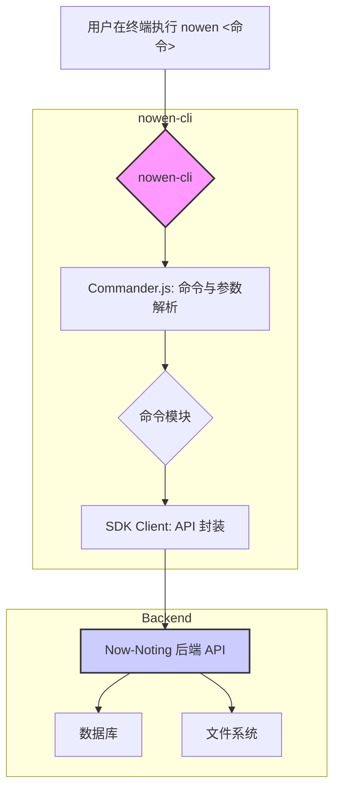

Now-Noting 提供了一个强大的命令行工具 (CLI) `nowen-cli`，旨在将笔记管理的核心功能无缝集成到开发者的终端环境中。这种集成允许用户在不离开命令行的情况下，快速执行诸如笔记创建、搜索、任务管理等操作，显著提升了工作流效率。本文档将深入解析 `nowen-cli` 的架构设计、核心依赖、命令结构以及其与后端服务的交互机制。

## 整体架构与核心依赖

`nowen-cli` 是一个基于 Node.js 和 TypeScript 构建的独立软件包，位于 `packages/nowen-cli` 目录中。其架构设计的核心是利用成熟的第三方库来处理命令行交互的复杂性，从而让开发者能够专注于业务功能的实现。

此架构体现了清晰的关注点分离：
1.  **命令入口**: `package.json` 文件通过 `bin` 字段将 `nowen` 命令映射到编译后的 `dist/cli.js` 文件，这是整个 CLI 应用的执行入口。
2.  **命令解析层**: 项目采用 **Commander.js** 库来定义和解析命令、选项和参数。`src/cli.ts` 文件是命令注册的中心，它初始化 `commander` 实例，并从 `src/commands/` 目录中加载所有具体的命令实现。
3.  **UI/UX 辅助层**: 为了提供更友好的用户体验，CLI 集成了 **Chalk** 用于在终端输出带颜色的文本，**Ora** 用于显示加载中的“旋转”动画，以及 **cli-table3** 用于将数据格式化为结构清晰的表格。
4.  **API 交互层**: `src/sdk-client.ts` 文件扮演着客户端 SDK 的角色。它封装了与 Now-Noting 后端服务进行通信的逻辑，将底层的 HTTP 请求（使用 `fetch`）转换为简单的方法调用，供各个命令模块使用。

Sources: [packages/nowen-cli/package.json](packages/nowen-cli/package.json#L4-L7), [packages/nowen-cli/src/cli.ts](packages/nowen-cli/src/cli.ts), [packages/nowen-cli/src/sdk-client.ts](packages/nowen-cli/src/sdk-client.ts)

## 命令结构与实现

`nowen-cli` 的功能通过模块化的命令进行组织，每个命令对应一个文件，存放在 `src/commands/` 目录下。这种设计使得添加新命令或修改现有命令变得简单且不易出错。

| 命令模块          | 文件路径                      | 主要功能                                                     |
| ----------------- | ----------------------------- | ------------------------------------------------------------ |
| **`notes`**       | `commands/notes.ts`           | 创建、读取、更新和删除笔记。                                 |
| **`notebooks`**   | `commands/notebooks.ts`       | 列出所有笔记本。                                             |
| **`tags`**        | `commands/tags.ts`            | 列出所有标签。                                               |
| **`tasks`**       | `commands/tasks.ts`           | 列出待办事项和已完成事项。                                   |
| **`search`**      | `commands/search.ts`          | 根据关键词全文搜索笔记。                                     |
| **`config`**      | `commands/config.ts`          | 配置与 Now-Noting 后端通信所需的 API 地址和认证令牌。        |
| **`ai`**          | `commands/ai.ts`              | 与集成的 AI 大语言模型进行交互，例如总结或翻译。             |

以 `notes` 命令为例，其实现模式清晰地展示了命令、SDK 和 UI 库的协同工作。当用户执行 `nowen notes create "My new note"` 时，Commander.js 解析出命令和参数，并调用 `notes.ts` 中定义的相应处理函数。该函数随后调用 `sdk-client.ts` 中的 `createNote` 方法，后者发起对后端的 API 请求。在等待响应期间，`ora` 会显示加载动画；请求成功后，结果会通过 `console.log` 或 `cli-table3` 进行格式化输出。

Sources: [packages/nowen-cli/src/commands/notes.ts](packages/nowen-cli/src/commands/notes.ts), [packages/nowen-cli/src/commands/config.ts](packages/nowen-cli/src/commands/config.ts), [packages/nowen-cli/src/commands/ai.ts](packages/nowen-cli/src/commands/ai.ts)

### 接下来

-   要了解后端如何处理这些 API 请求，请查阅 [后端架构：基于 Fastify 的插件化设计](7-hou-duan-jia-gou-ji-yu-fastify-de-cha-jian-hua-she-ji)。
-   若对 AI 功能的后端实现感兴趣，可以继续阅读 [AI 功能集成：与大语言模型的交互](13-ai-gong-neng-ji-cheng-yu-da-yu-yan-mo-xing-de-jiao-hu)。