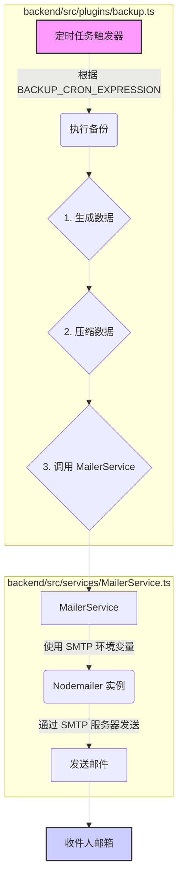

Now-Noting 提供了一项关键的数据保护功能：通过电子邮件定期备份您的笔记数据。为了启用此功能，系统需要连接到一个简单邮件传输协议（SMTP）服务器来发送这些备份邮件。本文档将作为一份操作指南，详细解释如何查找和配置必要的环境变量，以确保邮件备份功能正常运行。

## 为什么需要配置 SMTP？

数据备份是保障信息安全的核心环节。Now-Noting 将邮件备份设计为一种自动化、异地的容灾策略。启用该功能后，应用会定期将您的笔记数据打包，并通过您指定的邮箱账户发送到另一个安全邮箱。这样，即使用户的服务器或本地设备发生故障，仍然可以通过邮件找回数据，最大限度地减少损失。配置 SMTP 是激活这一自动化流程的前提，它授权 Now-Noting 应用使用您的邮件服务来发送备份。

## 核心配置：环境变量

系统的邮件服务配置完全通过环境变量进行管理。这种方式将敏感配置（如邮箱密码）与应用程序代码分离，提高了安全性与灵活性。您可以在项目的根目录中找到一个名为 `.env.example` 的模板文件，其中列出了所有可用的环境变量及其说明。

要配置邮件备份，您需要在部署环境中设置以下 SMTP 相关的变量：

| 环境变量              | 描述                                                                              | 示例值                     |
| --------------------- | --------------------------------------------------------------------------------- | -------------------------- |
| **`BACKUP_ENABLE`**       | 是否启用自动邮件备份功能。设置为 `true` 以开启。                                      | `true`                     |
| **`BACKUP_TO_EMAIL`**     | 接收备份文件的目标邮箱地址。这是您希望将数据备份发送到的地方。                          | `receiver@example.com`     |
| **`BACKUP_CRON_EXPRESSION`** | 定义备份任务执行周期的 CRON 表达式。默认值 `0 2 * * *` 表示每天凌晨 2 点执行。 | `0 2 * * *`                |
| **`SMTP_HOST`**           | 您的 SMTP 服务器地址。                                                            | `smtp.example.com`         |
| **`SMTP_PORT`**           | SMTP 服务器的端口号。通常，加密连接（SSL/TLS）使用 465 或 587 端口。             | `465`                      |
| **`SMTP_SECURE`**         | 是否使用加密连接（SSL/TLS）。如果端口是 465，通常应设置为 `true`。                   | `true`                     |
| **`SMTP_USER`**           | 用于登录 SMTP 服务器的邮箱账户用户名。                                            | `sender@example.com`       |
| **`SMTP_PASS`**           | 您的邮箱账户密码或专用的应用程序授权码。**强烈建议使用授权码而非主密码。**             | `your_app_specific_password` |
| **`SMTP_FROM_NAME`**      | 备份邮件中显示的发件人名称。                                                      | `Now-Noting 备份服务`        |
| **`SMTP_FROM_EMAIL`**     | 备份邮件中显示的发件人邮箱地址。通常与 `SMTP_USER` 相同。                         | `sender@example.com`       |

Sources: [.env.example](.env.example#L1-L26)

## 技术实现解析

为了更好地理解配置如何生效，我们可以探究其背后的代码实现。邮件备份功能主要由后端的 `backup` 插件负责。

这个流程展示了从定时任务触发到最终邮件发送的完整闭环：

1.  **定时任务 (`cron`)**: `backup.ts` 插件初始化时，会检查 `BACKUP_ENABLE` 变量。如果为 `true`，它会根据 `BACKUP_CRON_EXPRESSION` 创建一个定时任务。
2.  **数据处理**: 当任务触发时，插件会调用内部服务来导出和压缩用户数据。
3.  **邮件发送**: 接着，插件调用 `MailerService`。这个服务会读取所有 `SMTP_*` 相关的环境变量来配置 `Nodemailer`（一个流行的 Node.js 邮件发送库）。
4.  **完成投递**: `MailerService` 利用配置好的 `Nodemailer` 实例，将压缩后的备份数据作为附件，通过您指定的 SMTP 服务器发送到 `BACKUP_TO_EMAIL` 邮箱。

通过理解这一架构，开发者可以清晰地认识到，只需正确设置环境变量，即可驱动整个自动化备份流程，而无需改动任何代码。