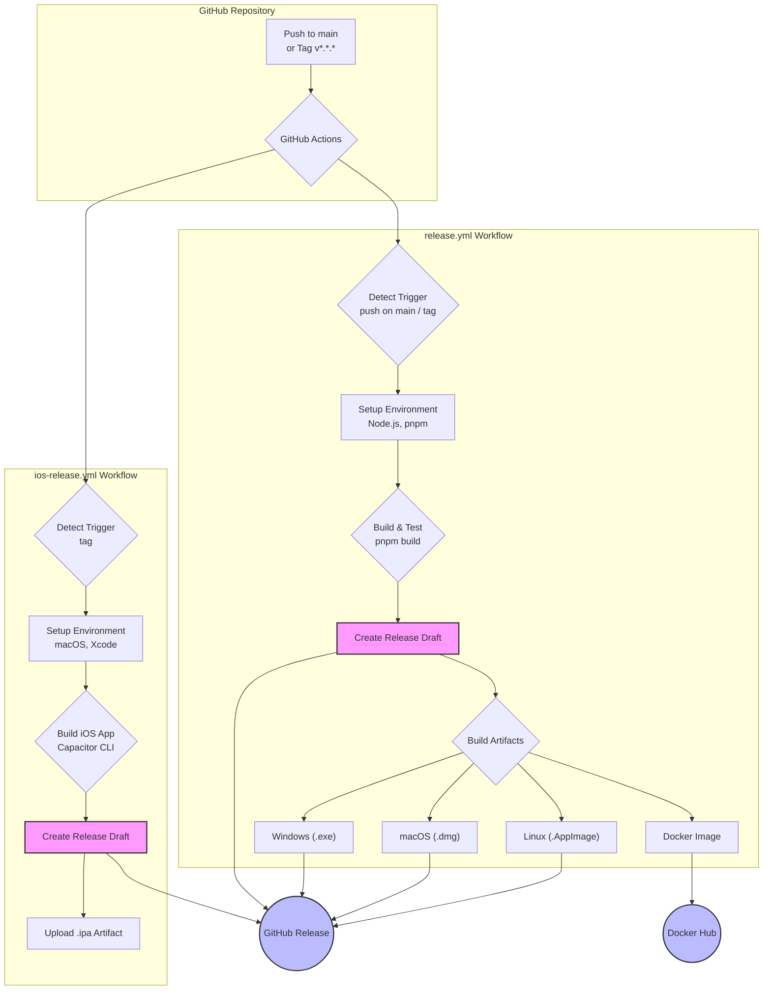

Now-Noting 借助 GitHub Actions 实现了全面的自动化构建、测试与发布流程。该流程覆盖了从代码提交到生成跨平台（Windows, macOS, Linux）桌面应用、创建 Docker 镜像以及发布新版本的全过程，确保了软件交付的一致性与高效率。本文档将深入解析其 CI/CD 工作流的设计与实现。

## 整体架构概览

项目的自动化流程由两个核心 GitHub Actions 工作流驱动，分别位于 `.github/workflows` 目录下。这两个工作流各司其职：`release.yml` 负责处理主要的桌面端应用和 Docker 镜像的构建与发布，而 `ios-release.yml` 则专门用于构建 iOS 应用。



此图展示了 CI/CD 的核心路径：
1.  **触发**: 当代码被推送到 `main` 分支或一个以 `v` 开头的标签（如 `v1.2.3`）被创建时，工作流被触发。
2.  **构建**: `release.yml` 并行构建适用于 Windows、macOS (Intel & Apple Silicon) 和 Linux 的桌面应用程序，并构建 Docker 镜像。同时，`ios-release.yml` 在检测到标签时，会独立构建 iOS 应用。
3.  **发布**: 所有构建的产物（二进制文件、安装包、`.ipa` 文件）都会被上传到 GitHub Releases 的一个草稿中。一旦构建完成，可以手动检查并发布该版本。Docker 镜像则会被推送到 Docker Hub。

Sources: [.github/workflows/release.yml](.github/workflows/release.yml#L1-L15)

## 核心工作流：`release.yml`

`release.yml` 是项目最核心的自动化工作流，它承担了绝大部分的构建和发布任务。它被设计为在每次向 `main` 分支推送代码时运行，或者在推送版本标签时执行完整的发布流程。

### 触发条件与权限

工作流通过 `on` 关键字定义了两个触发器：
- **`push: branches: [ main ]`**: 任何向 `main` 分支的推送都会触发此工作流，这主要用于持续集成，确保主分支的代码始终处于可构建状态。
- **`push: tags: [ 'v*.*.*' ]`**: 当一个符合 `v*.*.*` 模式的 Git 标签被推送时，触发完整的发布流程，包括创建 GitHub Release 和上传构建产物。

为了能够创建 Release 和上传产物，工作流被授予了 `contents: write` 权限，允许它写入仓库内容。

Sources: [.github/workflows/release.yml](.github/workflows/release.yml#L3-L15)

### 构建任务（`create-release` Job）

整个流程被组织在一个名为 `create-release` 的单一作业中。该作业内部通过 `strategy.matrix` 定义了一个构建矩阵，以实现在不同操作系统上并行构建。

```yaml
strategy:
  matrix:
    os: [ubuntu-latest, macos-latest, windows-latest]
```
这意味着接下来的所有步骤将在 Ubuntu、macOS 和 Windows 三个环境中同时执行，从而大大缩短了总构建时间。

工作流的关键步骤包括：
1.  **环境设置**: 使用 `actions/setup-node` 配置 Node.js 环境，并利用 `pnpm/action-setup` 来安装和缓存 pnpm，这是项目依赖管理的核心工具。
2.  **依赖安装**: 执行 `pnpm install --frozen-lockfile` 命令来精确安装所有依赖，`--frozen-lockfile` 确保了构建环境的一致性。
3.  **编译与构建**: 运行 `pnpm build` 命令。这是一个在根 `package.json` 中定义的脚本，它会调用 `electron-builder` 工具，根据当前的操作系统（`matrix.os`）构建对应的桌面应用（`.exe`, `.dmg`, `.AppImage`）。
4.  **Docker 构建与推送**: 这是一个条件步骤，仅在 `ubuntu-latest` Runner 上且事件为标签推送时执行。它使用 `docker/build-push-action` 来构建 Docker 镜像并将其推送到 Docker Hub。镜像的标签会包含版本号和 `latest`。
5.  **创建 Release 并上传产物**: 使用 `softprops/action-gh-release` 操作，将上一步骤中构建的所有文件（通过通配符 `release/Now-Noting-*` 匹配）上传到一个 GitHub Release 草稿中。这使得在正式发布前有机会进行最终审查。

Sources: [.github/workflows/release.yml](.github/workflows/release.yml#L17-L113)

## iOS 应用构建：`ios-release.yml`

`ios-release.yml` 是一个专门为构建和发布 iOS 客户端而设计的工作流。由于 iOS 应用的构建需要特定的环境（macOS 和 Xcode），因此将其从主工作流中分离出来是合理的架构选择。

此工作流的逻辑相对简单，并只在创建版本标签时触发。它不处理 `main` 分支的推送。

其核心步骤如下：
1.  **环境准备**: 必须在 `macos-latest` Runner 上运行。与 `release.yml` 类似，它首先设置 Node.js 和 pnpm 环境并安装依赖。
2.  **iOS 构建**: 关键步骤是运行 `pnpm run build:ios`。这个命令会触发一系列 Capacitor 的构建脚本，最终调用 Xcode 的命令行工具来编译和打包生成一个 `.ipa` 文件。
3.  **上传产物**: 构建成功后，生成的 `.ipa` 文件被上传到与版本标签对应的 GitHub Release 中。

这个分离的设计确保了 `release.yml` 的通用性，避免了在所有构建矩阵中引入仅适用于 iOS 的复杂依赖和环境配置。

Sources: [.github/workflows/ios-release.yml](.github/workflows/ios-release.yml#L1-L47)

---

通过理解这两个工作流的协同工作方式，开发者可以清晰地把握从代码提交到最终用户交付的整个自动化链路。若要进行二次开发或自定义构建，建议从修改根目录的 `package.json` 中的 `scripts` 和 `.github/workflows/` 下的 YAML 文件开始。

接下来，您可以深入了解 [桌面端应用打包与构建](5-zhuo-mian-duan-ying-yong-da-bao-yu-gou-jian)，以获取关于 `electron-builder` 配置和构建脚本的更多细节。