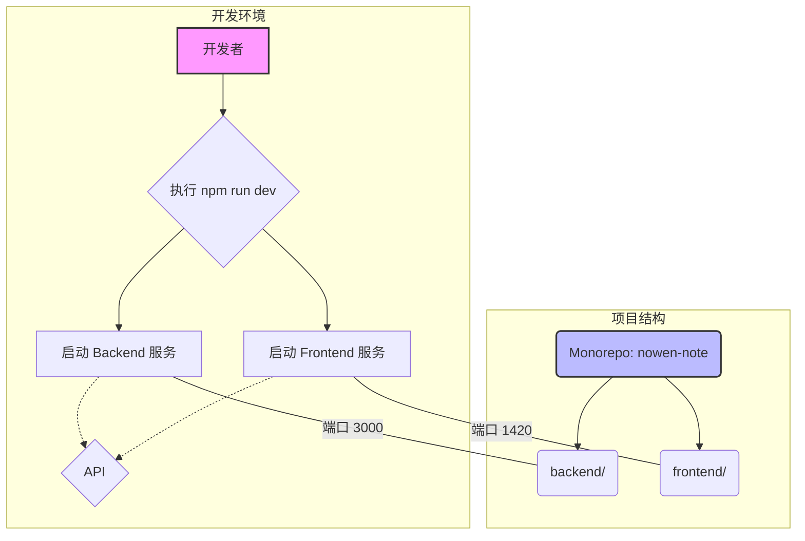

本文档为初级开发者提供了一份详尽的指南，旨在帮助您快速在本地环境中配置、部署并成功运行 Now-Noting 应用。通过遵循以下步骤，您将能够启动应用的后端服务和前端界面，为进一步的开发与探索奠定基础。

在开始之前，建议您先阅读 [概览：Now-Noting 一款开源、跨平台的笔记应用](1-gai-lan-now-noting-kuan-kai-yuan-kua-ping-tai-de-bi-ji-ying-yong)，以对项目有一个整体的认识。

## 1. 架构速览

Now-Noting 采用前后端分离的 Monorepo 架构。`backend` 服务基于 Node.js 和 Fastify 构建，负责数据处理与 API 供给；`frontend` 则使用 React 和 Vite 构建用户界面。两者通过 `npm` 工作空间（workspaces）进行管理，协同工作以提供完整的应用体验。



## 2. 环境准备

在启动应用之前，您需要确保本地开发环境已经安装了必要的工具。

*   **Node.js**: 建议使用 `v18.x` 或更高版本。
*   **npm**: 建议使用 `v7.x` 或更高版本，以确保对 Monorepo 工作区的良好支持。

此外，您还需要一个数据目录来存放应用的数据。在项目根目录下创建一个名为 `data` 的文件夹。

```bash
mkdir data
```

此目录将用于存储 SQLite 数据库文件、附件以及其他由应用生成的数据。
Sources: [package.json](package.json#L9-L23)

## 3. 安装与配置

项目依赖的安装和基础配置是运行应用的第一步。

### 步骤 1: 安装依赖

Now-Noting 将前端和后端的依赖管理整合到了根目录的 `package.json` 中。您只需在项目根目录执行一个命令，即可安装所有必需的依赖项。

```bash
# 执行此命令会分别进入 backend 和 frontend 目录安装依赖，并处理原生模块
npm run install:all
```
该命令会依次进入 `backend` 和 `frontend` 目录执行 `npm install`，并最后运行 `rebuild:native` 脚本以确保任何需要原生编译的模块能够正确适配您的操作系统。
Sources: [package.json](package.json#L11-L11)

### 步骤 2: 配置环境变量

环境变量用于配置应用的关键参数，例如数据库路径、附件存储位置等。项目提供了一个环境变量模板文件 `.env.example`，您可以复制它来创建自己的本地配置文件 `.env`。

```bash
cp .env.example .env
```

对于基础的本地部署，默认配置通常已经足够。默认情况下，应用配置如下：

*   **数据库**: 使用位于 `data/` 目录下的 SQLite 数据库。
*   **附件存储**: 附件将存储在 `data/attachments/` 目录中。
*   **服务端口**: 后端服务运行在 3000 端口。

下表列出了一些基础配置项及其说明：
| 变量名 | 说明 | 默认值 |
| :--- | :--- | :--- |
| `DB_CLIENT` | 数据库类型 | `sqlite` |
| `DB_DATABASE` | SQLite 数据库文件路径 | `./data/db.sqlite` |
| `ATTACHMENT_PATH` | 附件存储路径 | `./data/attachments` |

Sources: [.env.example](.env.example#L1-L24)

## 4. 启动应用

完成安装和配置后，您可以通过一个集成的命令同时启动前后端开发服务器。

在项目根目录下，执行以下命令：
```bash
# 此命令将同时启动后端服务和前端开发服务器
npm run dev
```
此命令实际上是 `npm-run-all` 的一个快捷方式，它会并行执行 `dev:backend` 和 `dev:frontend` 两个脚本。

*   `dev:backend`: 启动 Fastify 后端服务，默认监听 `http://localhost:3000`。
*   `dev:frontend`: 启动 Vite 前端开发服务器，默认监听 `http://localhost:1420`。

当您在终端看到类似以下的输出时，代表前后端服务均已成功启动：

```
# 后端服务日志
[backend] > backend@1.0.23 dev:backend
[backend] > npx tsx src/index.ts
[backend] Server listening at http://127.0.0.1:3000

# 前端服务日志
[frontend] > frontend@0.0.0 dev:frontend
[frontend] > npx vite
[frontend]
[frontend]   VITE v5.5.0  ready in 1.23s
[frontend]
[frontend]   ➜  Local:   http://localhost:1420/
[frontend]   ➜  Network: use --host to expose
[frontend]   ➜  press h + enter to show help
```

现在，您可以打开浏览器并访问 **http://localhost:1420**，即可看到 Now-Noting 的应用界面。

Sources: [package.json](package.json#L9-L10)

## 下一步

成功在本地运行 Now-Noting 是深入了解该项目的第一步。接下来，您可以根据自己的兴趣选择不同的探索路径：
*   **容器化部署**: 如果您对使用容器技术进行部署感兴趣，请查阅 [使用 Docker 和 Docker Compose 部署](3-shi-yong-docker-he-docker-compose-bu-shu)。
*   **桌面应用**: 想要了解如何将应用打包成独立的桌面客户端，请前往 [桌面端应用打包与构建](5-zhuo-mian-duan-ying-yong-da-bao-yu-gou-jian)。
*   **架构探索**: 如果您想从更高层面理解项目的设计哲学，推荐从 [整体架构：Monorepo 多端应用实践](6-zheng-ti-jia-gou-monorepo-duo-duan-ying-yong-shi-jian) 开始。