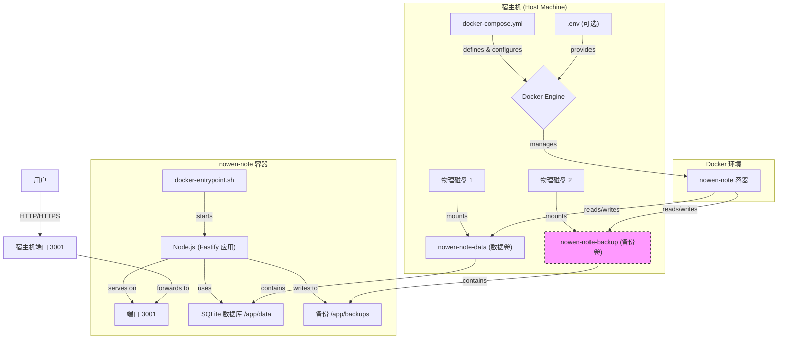
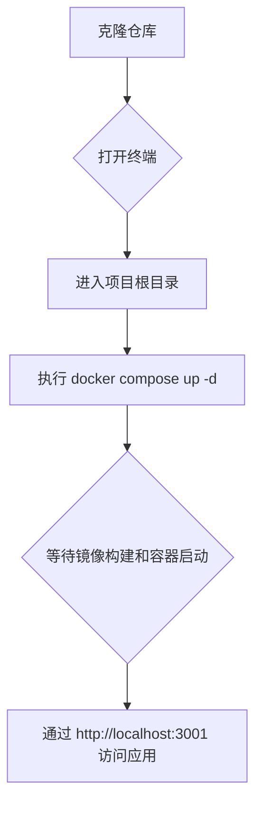

本文档旨在为中级开发人员提供使用 Docker 和 Docker Compose 部署 Now-Noting 应用的详细指南。遵循本指南，您将能够快速、可靠地在独立的容器环境中启动并运行整个应用。我们将深入探讨配置文件、数据持久化策略以及关键环境变量的设置。

在开始之前，我们假设您已经对 Docker 和 Docker Compose 的基本概念有所了解。

## 架构概览

Now-Noting 的 Docker 部署架构围绕一个核心服务容器 `nowen-note` 展开。此容器封装了 `backend` 应用及其所有依赖项。`docker-compose.yml` 文件负责编排此服务，并精心管理数据持久化与配置。

为了更清晰地理解各组件之间的关系，请参考以下 Mermaid 图示：



此图展示了从用户请求到容器内部处理，再到数据如何通过 Docker 卷持久化到宿主机物理磁盘的完整流程。特别需要注意的是，为了数据安全，应用数据卷 (`nowen-note-data`) 和备份卷 (`nowen-note-backup`) 被设计为可以挂载到不同的物理介质上。

## 快速启动步骤

通过 `docker-compose.yml` 文件，可以一键启动应用。该文件已经预设了合理的默认值，用户无需修改即可在大多数情况下直接运行。



执行以下命令即可启动服务：

```bash
# 在项目根目录下执行
docker compose up -d
```

这个命令会以后台模式（`-d`）启动 `nowen-note` 服务。Docker 会首先根据 `Dockerfile` 构建镜像（如果本地不存在），然后创建并启动容器。服务将在宿主机的 3001 端口上可用。

Sources: [docker-compose.yml](docker-compose.yml#L1-L20)

## 核心配置解析

`docker-compose.yml` 文件是部署的核心，它定义了服务的构建方式、端口映射、数据卷和环境变量。理解这些配置对于后续的维护和自定义至关重要。

| 配置项 | 示例值 | 说明 |
| :--- | :--- | :--- |
| `build.context` | `.` | 指定 Docker 构建上下文为项目根目录。 |
| `build.dockerfile` | `Dockerfile` | 用于构建服务镜像的 Dockerfile 文件名。 |
| `image` | `nowen-note:latest` | 构建成功后镜像的名称和标签。 |
| `container_name` | `nowen-note` | 指定容器的名称，方便管理。 |
| `restart` | `unless-stopped` | 容器总是在退出时自动重启，除非被手动停止。 |
| `ports` | `- "3001:3001"` | 将宿主机的 3001 端口映射到容器的 3001 端口。 |

Sources: [docker-compose.yml](docker-compose.yml#L1-L20)

## 数据持久化与备份策略

为了确保用户数据的安全性和持久性，Now-Noting 采用 Docker 数据卷（Volumes）来存储所有关键数据。这种方式将数据生命周期与容器生命周期解耦，即使容器被删除或重建，数据依然保留。

### 数据卷 (Data Volume)

默认配置创建了一个名为 `nowen-note-data` 的数据卷，并将其挂载到容器的 `/app/data` 目录下。该目录是应用存放 SQLite 数据库文件（`nowen-note.db`）、附件、日志和其他持久化信息的根路径。

Sources: [docker-compose.yml](docker-compose.yml#L21-L22), [docker-compose.yml](docker-compose.yml#L59-L60)

### 备份卷 (Backup Volume)

为了遵循 `3-2-1` 备份原则，强烈建议将备份数据存储在与主数据不同的物理介质上。默认情况下，备份会保存在数据卷内部的 `backups` 子目录，这在数据卷损坏时无法提供保护。`docker-compose.yml` 文件中提供了启用独立备份卷的注释示例，您可以取消注释来激活一个名为 `nowen-note-backup` 的独立卷，并将其挂载到容器的 `/app/backups` 目录。

启用独立备份卷的步骤：
1.  在 `services.nowen-note.volumes` 部分，取消 `- nowen-note-backup:/app/backups` 的注释。
2.  在 `services.nowen-note.environment` 部分，取消 `- BACKUP_DIR=/app/backups` 的注释。**此步骤至关重要**，它会告知应用将备份写入新的挂载点。
3.  在根级的 `volumes` 部分，取消 `nowen-note-backup` 的定义。

通过这种配置，即使 `nowen-note-data` 卷意外损坏或被删除，您的备份数据依然安全。

Sources: [docker-compose.yml](docker-compose.yml#L23-L44), [docker-compose.yml](docker-compose.yml#L55-L56), [docker-compose.yml](docker-compose.yml#L61-L63)

## 环境变量与启动脚本

Now-Noting 容器在启动时通过 `docker-entrypoint.sh` 脚本来完成初始化。该脚本的核心职责之一是处理敏感配置，如 `JWT_SECRET`。

如果 `.env` 文件不存在，该脚本会检测 `/app/data/.env` 是否存在。如果两者都不存在（即首次启动），脚本会自动生成一个包含强随机 `JWT_SECRET` 的 `.env` 文件，并将其保存到数据卷的 `/app/data/.env` 路径下。这样既保证了开箱即用，又实现了密钥的持久化，避免了容器重启导致用户登录失效的问题。

`docker-compose.yml` 被配置为优先加载项目根目录下的 `.env` 文件。这意味着如果您需要手动指定 `JWT_SECRET`（例如在多实例部署中共享密钥），只需在 `docker-compose.yml` 旁边创建一个 `.env` 文件并填入相应的值即可，它将覆盖容器内的自动生成逻辑。

| 环境变量 | 作用 | 来源/设置方式 |
| :--- | :--- | :--- |
| `NODE_ENV` | `production` | 在 `docker-compose.yml` 中硬编码，优化性能。 |
| `DB_PATH` | `/app/data/nowen-note.db` | 在 `docker-compose.yml` 中硬编码，指向数据卷。 |
| `PORT` | `3001` | 在 `docker-compose.yml` 中硬编码，定义服务端口。 |
| `JWT_SECRET` | 随机生成或手动设置 | 由 `docker-entrypoint.sh` 在首次启动时自动生成，或通过 `.env` 文件手动覆盖。 |
| `BACKUP_DIR` | `/app/backups` | （可选）在 `docker-compose.yml` 中设置，以启用独立备份目录。 |
| `OLLAMA_URL` | e.g. `http://host.docker.internal:11434` | （可选）在 `docker-compose.yml` 中设置，用于集成 Ollama AI 功能。 |

Sources: [docker-entrypoint.sh](docker-entrypoint.sh#L1-L22), [docker-compose.yml](docker-compose.yml#L45-L58)

部署完成后，您可以继续探索更多高级主题。如果您使用的是 ARM64 架构的设备（如树莓派、特定云服务器等），请继续阅读 [ARM64 架构下的部署方法](4-arm64-jia-gou-xia-de-bu-shu-fang-fa)。