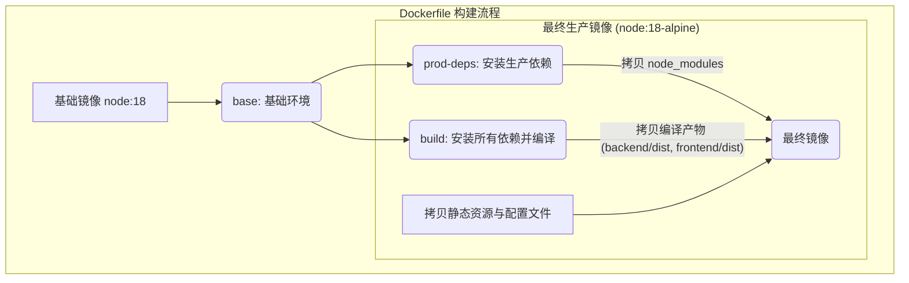

本文档为在 ARM64（如 Apple Silicon M 系列芯片、树莓派等）架构的设备上部署 Now-Noting 应用提供技术指南。由于官方 Docker Hub 镜像主要基于 x86 (amd64) 架构构建，直接在 ARM64 环境下运行可能会遇到兼容性问题。本指南将阐述如何通过本地构建多平台 Docker 镜像来解决这一挑战。

我们的分析将遵循以下步骤：
1.  **识别问题**：解释为何预构建的 Docker 镜像在 ARM64 上存在问题。
2.  **定位解决方案**：通过分析项目中的 `Dockerfile` 和 `docker-compose.yml`，确定本地构建是解决跨平台部署的关键。
3.  **提供操作指南**：给出在 ARM64 环境下构建和运行应用的具体步骤。

Sources: [docker-compose.yml](docker-compose.yml#L1-L26), [Dockerfile](Dockerfile#L1-L50)

## 核心问题：镜像架构不兼容

大多数云服务和持续集成（CI/CD）系统默认使用 x86/amd64 架构的计算机构建 Docker 镜像。Now-Noting 官方提供的 `registry.cn-hangzhou.aliyuncs.com/nowen/now-noting` 镜像也是基于此架构构建的。当您尝试在 ARM64 架构的系统（例如搭载 Apple M1/M2/M3 芯片的 Mac 或树莓派）上直接运行此镜像时，Docker 会因为找不到与当前平台匹配的镜像版本而失败。

项目根目录下的 `docker-compose.yml` 文件定义了应用的服务栈，其中 `now-noting-server` 服务直接引用了预构建的 amd64 镜像。虽然 Docker Desktop 等工具提供了 QEMU 模拟执行非原生架构镜像的功能，但这会导致显著的性能下降和潜在的稳定性问题，尤其对于数据库等I/O密集型服务，因此不推荐在生产或日常开发中使用。

Sources: [docker-compose.yml](docker-compose.yml#L16-L18)

## 解决方案：本地构建多平台镜像

为了在 ARM64 架构上原生运行，我们需要利用项目提供的 `Dockerfile` 文件在本地构建一个适用于 `linux/arm64` 平台的镜像。`Dockerfile` 本身设计良好，已经考虑到了跨平台构建的需求。

`Dockerfile` 采用了多阶段构建（Multi-stage build）策略，以优化最终镜像的大小和安全性：
1.  **`base` 阶段**：基于 `node:18` 镜像创建一个基础环境，并设置工作目录。
2.  **`prod-deps` 阶段**：安装生产环境所需的 Node.js 依赖。通过 `npm ci --omit=dev` 命令，可以确保只安装 `package.json` 中定义的生产依赖，避免引入不必要的开发工具。
3.  **`build` 阶段**：同样基于 `base` 阶段，安装所有依赖（包括开发依赖），并执行 `npm run build` 命令来编译和打包前端与后端代码。
4.  **最终阶段**：基于一个轻量级的 `node:18-alpine` 镜像，从 `prod-deps` 和 `build` 阶段拷贝必要的生产依赖、编译产物以及静态资源，构建出最终的生产镜像。这种方式确保了最终镜像只包含运行应用所必需的文件，体积更小，攻击面也更少。



这种分层和模块化的构建方法，使得我们可以通过 Docker Buildx 工具轻松地为不同的平台（如 `linux/amd64` 和 `linux/arm64`）构建原生镜像。

Sources: [Dockerfile](Dockerfile#L1-L50)

## ARM64 部署操作指南

以下步骤将指导您如何在 ARM64 设备上成功构建并运行 Now-Noting。

### 步骤 1: 修改 docker-compose.yml

首先，需要编辑项目根目录下的 `docker-compose.yml` 文件。找到 `now-noting-server` 服务定义，将 `image` 配置注释掉，并用 `build: .` 替代。这会告诉 Docker Compose 不要去拉取预构建的镜像，而是在当前目录（`.`）下寻找 `Dockerfile` 并执行本地构建。

**修改前**:
```yaml
services:
  now-noting-server:
    image: registry.cn-hangzhou.aliyuncs.com/nowen/now-noting:latest
    # ...
```

**修改后**:
```yaml
services:
  now-noting-server:
    build: .
    # ...
```
这一修改是部署的关键，它将 Docker Compose 的行为从“拉取”转变为“构建”。

Sources: [docker-compose.yml](docker-compose.yml#L17)

### 步骤 2: 构建并启动服务

完成上述修改后，在项目根目录下打开终端，运行以下命令。此命令会利用 Docker Compose 读取编排文件，为 ARM64 平台构建一个新的 `now-noting-server` 镜像，并随后启动所有定义的服务。

```bash
docker-compose up -d --build
```

- **`up`**: 创建并启动容器。
- **`-d`**: 以分离模式（detached mode）在后台运行。
- **`--build`**: 强制 Docker Compose 在启动容器前执行构建过程。

首次执行此命令可能需要较长时间，因为它需要下载基础镜像、安装所有 Node.js 依赖并执行项目编译。构建完成后，后续启动速度会显著加快，除非 `Dockerfile` 或项目源文件发生变化。

### 步骤 3: 验证部署

服务启动后，您可以通过以下命令查看容器日志，确认 `now-noting-server` 是否正常运行。如果看到应用成功监听端口的日志，则表示部署成功。

```bash
docker-compose logs -f now-noting-server
```

此时，您应该可以根据 `docker-compose.yml` 中配置的端口（默认为 8001）在浏览器中访问 Now-Noting 应用。至此，您已在 ARM64 设备上成功部署了 Now-Noting 的原生运行实例。