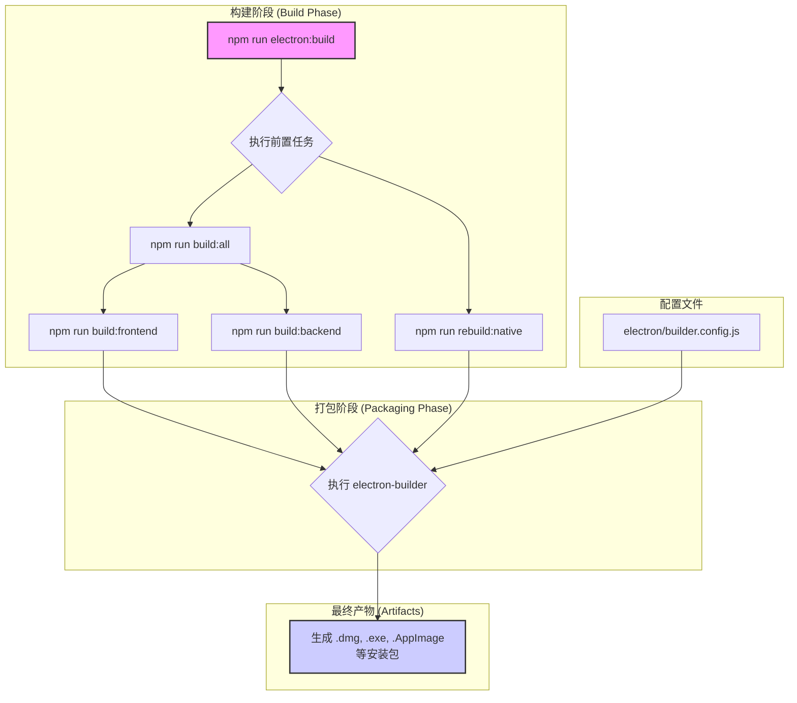

本文档为高级开发者提供 Now-Noting 桌面端应用的打包与构建指南。桌面端应用基于 Electron 构建，使用 `electron-builder` 进行打包，以生成适用于 Windows、macOS 和 Linux 的可分发安装程序。整个构建流程通过根目录下的 `package.json` 文件中的 `npm` 脚本进行协调，并辅以 `electron` 和 `scripts` 目录中的配置文件与辅助脚本。

Sources: [package.json](package.json#L28-L36), [electron/builder.config.js](electron/builder.config.js)

## 核心构建流程与脚本

Now-Noting 的桌面端构建流程被设计为模块化和可配置的，以适应不同的开发和发布需求。核心流程首先构建前端和后端代码，然后调用 `electron-builder` 并结合特定配置文件来打包最终的应用程序。



上图展示了执行 `npm run electron:build` 命令后的完整流程。该命令首先触发 `build:all`，它负责编译前端（React）和后端（Fastify）的 TypeScript 代码。同时，`rebuild:native` 脚本会重新编译项目中可能存在的原生 Node.js 模块，以确保它们与 Electron 的内部 Node.js 环境兼容。所有构建产物准备就绪后，`electron-builder` 会依据 `electron/builder.config.js` 文件中的配置进行最终的应用打包。

Sources: [package.json](package.json#L29-L36), [electron/builder.config.js](electron/builder.config.js)

## 构建配置详解

项目提供了两种主要的构建配置，分别用于“完整版”和“精简版”的打包，以满足不同使用场景的需求。

### 完整版构建 (Full Build)

完整版构建旨在生成一个功能齐全、包含所有依赖项（如 `pandoc`）的桌面应用。这是用于正式发布的标准构建模式。

- **触发命令**: `npm run electron:build`
- **配置文件**: `electron/builder.config.js`
- **核心配置**: 该配置文件包含了 `electron-builder` 所需的全部参数，例如 `appId`、产品名称、版权信息、以及针对不同操作系统（macOS, Windows, Linux）的特定打包选项。其中，`extraResources` 字段被用来包含 `pandoc` 等外部二进制文件，这些文件会在应用安装后被复制到相应的资源目录中，供应用在运行时调用。

| 配置项 | 描述 |
| --- | --- |
| `appId` | 应用程序的唯一标识符，通常采用反向域名表示法。 |
| `productName` | 最终生成的可执行文件和安装程序所显示的产品名称。 |
| `copyright` | 版权信息。 |
| `directories` | 指定输出目录 (`output`) 和构建资源目录 (`buildResources`)。 |
| `files` | 定义哪些文件和目录需要被包含在最终的 `app.asar` 归档中。 |
| `extraResources` | 定义需要打包到应用资源目录的额外文件，如 `pandoc`。 |

Sources: [electron/builder.config.js](electron/builder.config.js#L1-L127)

### 精简版构建 (Lite Build)

精简版构建用于生成一个不包含 `pandoc` 等大型外部依赖的轻量级版本。这个版本的应用体积更小，但部分依赖 `pandoc` 的高级功能（如复杂的文档导入导出）将不可用。它主要适用于那些不需要完整文档格式转换功能的用户，或在开发环境中进行快速测试。

- **触发命令**: `npm run electron:build:lite`
- **配置文件**: `electron/builder.lite.config.js`
- **核心差异**: `builder.lite.config.js` 文件继承自 `builder.config.js`，但通过 `import` 和对象扩展的方式移除了 `extraResources` 中关于 `pandoc` 的条目。这意味着 `pandoc` 二进制文件不会被打包进应用中，从而显著减小了安装包的体积。

```javascript
// electron/builder.lite.config.js 示例
import config from './builder.config.js';

// 移除 pandoc 相关的 extraResources
config.extraResources = config.extraResources.filter(
  item => !(typeof item === 'object' && item.from.includes('pandoc'))
);

config.productName = 'Now-Noting Lite';

export default config;
```

这种设计通过配置文件的继承和覆盖，实现了代码的复用，同时清晰地分离了不同构建版本的差异。

Sources: [electron/builder.lite.config.js](electron/builder.lite.config.js#L1-L15)

## 签名与公证 (macOS)

为了确保应用在 macOS 系统上的正常分发和运行，避免出现“未识别的开发者”警告，应用需要进行代码签名和公证。

- **签名后脚本**: `build/afterSign.js` 文件定义了一个在 `electron-builder` 完成应用签名后自动执行的钩子函数。此脚本的主要职责是调用 `electron-notarize` 工具，将已签名的应用包提交给苹果进行公证。
- **权限配置文件**: `build/entitlements.mac.plist` 是一个 XML 文件，用于声明应用在 macOS 沙箱环境下需要获取的特定权限，例如访问文件系统或网络的能力。`electron-builder` 在签名过程中会使用此文件来嵌入相应的权限信息。

这些自动化步骤是 CI/CD 流程中的关键环节，确保了发布的 macOS 应用能够符合苹果的安全策略。

Sources: [build/afterSign.js](build/afterSign.js#L1-L26), [build/entitlements.mac.plist](build/entitlements.mac.plist#L1-L14)

---

完成桌面端应用的构建后，您可能希望了解应用的整体架构或 CI/CD 发布流程。

- **下一步**:
  - [桌面端架构：Electron 主进程与渲染进程通信](9-zhuo-mian-duan-jia-gou-electron-zhu-jin-cheng-yu-xuan-ran-jin-cheng-tong-xin)
  - [构建与发布流程：GitHub Actions CI/CD](18-gou-jian-yu-fa-bu-liu-cheng-github-actions-ci-cd)