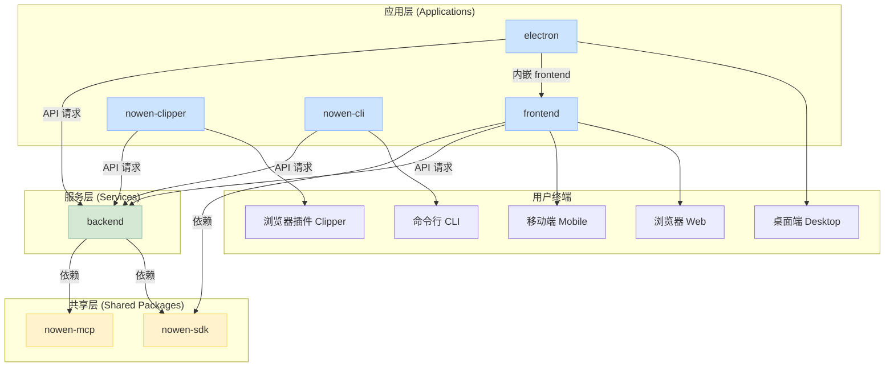

Now-Noting 采用 Monorepo（单一代码仓库）架构，将所有项目代码（包括后端服务、前端应用、桌面端、共享库等）集中管理在一个 Git 仓库中。这种模式旨在简化依赖管理、促进代码复用，并统一开发与构建流程。本文将深入解析该项目的代码组织结构、工作空间管理机制以及各个子项目之间的关系。

## 1. Monorepo 与 PNPM Workspaces

项目通过 PNPM Workspaces 来实现 Monorepo 的管理。`pnpm-workspace.yaml` 文件是其核心配置文件，它定义了哪些目录下的 `package.json` 文件应被识别为工作空间内的子项目。这种机制使得在根目录下执行 `pnpm install` 时，所有子项目的依赖都会被正确安装，并且子项目之间可以相互引用，无需发布到 NPM 仓库。

`pnpm-workspace.yaml` 的内容明确指定了 `backend`、`frontend`、`electron` 以及 `packages` 目录下的所有子目录都是工作空间的成员。这种声明式的结构清晰地勾勒出了整个项目的宏观布局。

Sources: [pnpm-workspace.yaml](pnpm-workspace.yaml#L1-L5)

## 2. 核心应用与共享包结构

项目的整体架构可以划分为三个层次：**核心应用**、**扩展工具**和**共享包**。这种分层设计确保了不同目标平台（Web、桌面、移动端）与功能（剪藏器、命令行）既能独立演进，又能共享底层能力。

以下是各主要目录的职责分析：

| 目录 | 类型 | 描述 | 关键技术 |
| :--- | :--- | :--- | :--- |
| `backend` | 核心应用 | 后端 API 服务，负责数据处理、用户认证和业务逻辑。 | Fastify, TypeScript |
| `frontend` | 核心应用 | 跨平台的 UI 层，通过 Capacitor 打包成移动端应用。 | React, Vite, Capacitor |
| `electron` | 核心应用 | 桌面端应用主程序，封装 `frontend` 作为其渲染进程的界面。 | Electron, JavaScript |
| `packages/nowen-clipper` | 扩展工具 | 浏览器扩展程序，用于网页剪藏。 | React, Vite, WebExtension API |
| `packages/nowen-cli` | 扩展工具 | 命令行工具，提供脚本化操作能力。 | TypeScript, Commander.js |
| `packages/nowen-sdk` | 共享包 | 软件开发工具包，封装了与后端 API 交互的类型定义和客户端。 | TypeScript |
| `packages/nowen-mcp` | 共享包 | Master Control Program，用于特定服务或任务的控制模块。 | TypeScript |

这种清晰的职责划分，使得项目既保持了整体的一致性，又赋予了各部分足够的灵活性。例如，当需要修复一个仅影响移动端 UI 的问题时，开发者可以专注于 `frontend` 目录，而无需担心对 `backend` 或 `electron` 造成意外影响。

Sources: [pnpm-workspace.yaml](pnpm-workspace.yaml#L1-L5), [package.json](package.json#L5-L12)

## 3. 跨应用代码共享机制

Monorepo 架构的核心优势之一是代码共享。在 Now-Noting 中，`packages` 目录扮演了这一关键角色，特别是 `nowen-sdk`。

`nowen-sdk` 是一个典型的共享包，它定义了与后端 API 通信所需的数据结构（Types）和客户端逻辑。通过在 `backend` 和 `frontend` 的 `package.json` 中声明对 `nowen-sdk` 的工作空间依赖（`"nowen-sdk": "workspace:*"`），实现了前后端类型安全和 API 调用的统一。任何在 `nowen-sdk` 中对 API 类型的修改，都会立刻在 `frontend` 和 `backend` 的开发环境中得到类型检查，从而在编码阶段就避免了潜在的集成错误。

Sources: [frontend/package.json](frontend/package.json#L50-L75), [backend/package.json](backend/package.json#L40-L54), [packages/nowen-sdk/package.json](packages/nowen-sdk/package.json#L1-L15)

## 4. 统一的构建与脚本管理

项目的根 `package.json` 文件是整个 Monorepo 的总入口和指挥中心。它利用 `pnpm --filter <package_name>` 命令，实现了对特定子项目执行命令的能力。例如，`pnpm --filter backend dev` 可以启动后端开发服务器，而 `pnpm --filter frontend build` 则可以构建前端应用。

脚本被统一管理在此文件中，定义了诸如开发、构建、测试和部署等标准化流程。这种集中化的脚本管理，不仅为开发者提供了统一的操作界面，也为 CI/CD 自动化流程（如 GitHub Actions）奠定了坚实的基础，确保了在不同环境下构建和测试行为的一致性。

Sources: [package.json](package.json#L13-L27)

通过对项目架构的初步探索，我们了解了其 Monorepo 的组织方式和核心优势。接下来，你可以根据兴趣深入了解特定部分的设计：
- [后端架构：基于 Fastify 的插件化设计](7-hou-duan-jia-gou-ji-yu-fastify-de-cha-jian-hua-she-ji)
- [前端架构：基于 React 和 Capacitor 的跨平台 UI](8-qian-duan-jia-gou-ji-yu-react-he-capacitor-de-kua-ping-tai-ui)
- [桌面端架构：Electron 主进程与渲染进程通信](9-zhuo-mian-duan-jia-gou-electron-zhu-jin-cheng-yu-xuan-ran-jin-cheng-tong-xin)