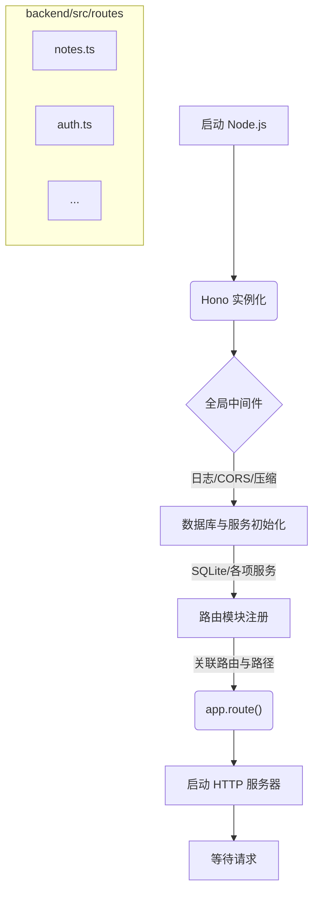
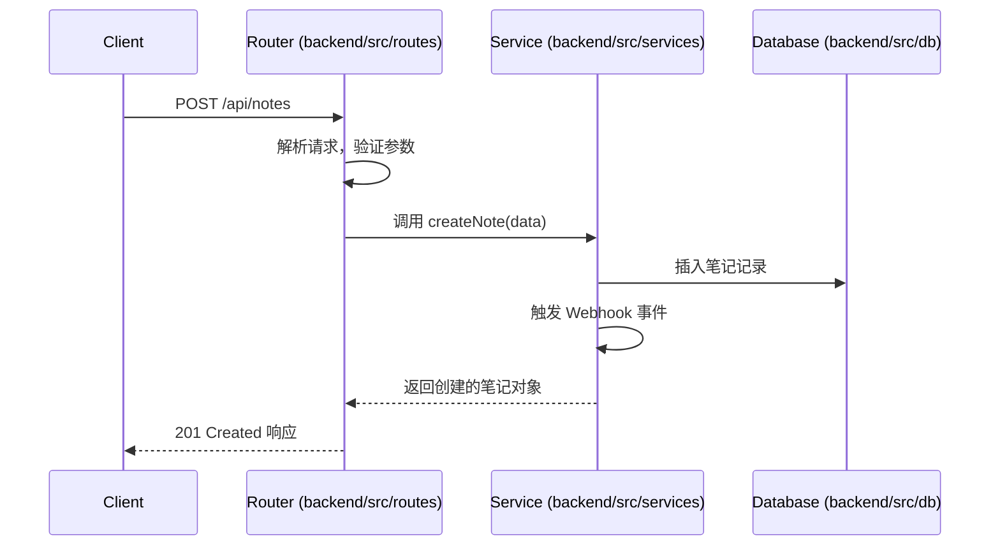

Now-Noting 的后端服务采用轻量级的 Web 框架 Hono 构建，它负责处理所有核心业务逻辑，包括数据操作、用户认证、文件管理和 AI 服务集成。架构设计的核心原则是模块化和可扩展性，通过将功能拆分到独立的服务和路由模块中，实现了清晰的代码组织和高效的维护。虽然最初的技术选型可能考虑过 Fastify，但项目最终采用 Hono 作为其基础框架，利用其简洁的 API 和中间件模式来构建一个稳健的 API 服务。

## 核心框架与启动流程

系统的起点是 `backend/src/index.ts` 文件，它扮演着服务引导程序的角色。该文件负责初始化 Hono 应用实例，加载全局中间件，注册所有路由模块，并启动 HTTP 服务器。整个过程遵循一个明确的生命周期，确保所有依赖项和服务在接收请求之前都已准备就绪。

1.  **初始化 Hono 实例**：创建一个 `Hono` 应用实例，作为所有中间件和路由的挂载点。
2.  **全局中间件注册**：应用一系列全局中间件，用于处理日志 (`logger`)、跨域资源共享 (`cors`) 和 HTTP 响应压缩 (`compress`)。这些中间件会应用于所有传入的请求。
3.  **数据库与服务初始化**：在注册路由之前，系统会调用 `getDb()` 初始化数据库连接，并执行 `seedDatabase()` 来确保基础数据的存在。同时，还会预先初始化审计、Webhooks、API 令牌等核心服务所需的数据表，避免在运行时因表不存在而产生错误日志。
4.  **路由模块注册**：系统将不同的 API 端点按照业务领域（如 `notes`, `users`, `auth`）划分到独立的路由文件 (`backend/src/routes/*.ts`) 中。`index.ts` 通过 `app.route()` 方法将这些模块化的路由与特定的 URL 前缀关联起来，例如将 `authRouter` 挂载到 `/api/auth` 路径。
5.  **启动服务器**：最后，通过 Hono 的适配器 `@hono/node-server` 启动 Node.js 服务器，并开始监听端口，准备处理 API 请求。

这个结构化的启动流程确保了服务在不同环境中的一致性和可预测性。

Sources: [backend/src/index.ts](backend/src/index.ts#L53-L84), [backend/src/index.ts](backend/src/index.ts#L206-L232)

## 路由与中间件

Hono 的核心优势在于其优雅的中间件和路由机制。在本项目中，路由被精细地组织在 `backend/src/routes/` 目录下，每个文件对应一个独立的业务模块。这种设计使得开发者可以轻松地定位和修改特定功能的代码。

- **模块化路由**：每个路由文件（如 `notes.ts`, `users.ts`）都导出一个 `Hono` 实例。主文件 `index.ts` 导入这些实例，并使用 `app.route('/api/path', router)` 的方式将它们集成到主应用中。这种模式类似于微服务架构中的 API 网关，但运行在单个进程中，既保持了代码的独立性，又避免了网络通信的开销。
- **中间件应用**：中间件在架构中扮演着关键角色，用于处理横切关注点。
    - **全局中间件**：如 `logger` 和 `cors`，在启动时应用，影响所有请求。
    - **特定路由中间件**：例如，在 `/api/shared/*` 路径上应用了自定义的速率限制中间件，以防止暴力破解和恶意请求。
    - **认证中间件**：`verifyLoginToken` 中间件被应用于绝大多数需要用户登录才能访问的私有路由上，通过校验 JWT 来保护端点。

这种分层的中间件策略使得安全性和通用逻辑可以被集中管理，同时保持了路由处理程序的简洁和专注。

| 模块类别 | 目录 | 职责 |
| :--- | :--- | :--- |
| **路由定义** | `backend/src/routes/` | 负责定义 API 端点、验证请求参数并调用相应的服务层方法。 |
| **认证逻辑** | `backend/src/lib/auth-security.ts` | 提供生成和验证 JWT 的函数，作为中间件保护路由。 |
| **访问控制** | `backend/src/middleware/acl.ts` | 实现基于角色的访问控制逻辑，确保用户只能操作其有权限的资源。 |

Sources: [backend/src/index.ts](backend/src/index.ts#L87-L90), [backend/src/index.ts](backend/src/index.ts#L206-L232)

## 服务层与业务逻辑

为了遵循关注点分离原则，所有核心业务逻辑都被封装在 `backend/src/services/` 目录下的服务模块中。路由处理程序本身保持轻量，其主要职责是接收 HTTP 请求，调用服务层的方法，然后将结果格式化为 HTTP 响应。

这种分层设计带来了显著的优势：
- **可测试性**：业务逻辑与 Web 框架解耦，可以独立进行单元测试，无需模拟完整的 HTTP 请求-响应周期。
- **可重用性**：同一个业务逻辑（例如，发送邮件）可以被不同的路由处理程序甚至其他服务模块调用。
- **清晰性**：`services` 目录清晰地展示了系统的核心能力，如 `backup.ts`（备份管理）、`email.ts`（邮件发送）、`vec-store.ts`（向量存储与搜索）等。

例如，当一个创建笔记的请求到达 `/api/notes` 时，路由处理程序会解析请求体，然后调用 `noteService` 中的一个方法来处理数据库插入、文件系统操作以及触发 Webhooks 等一系列复杂的业务操作。

通过这种方式，后端架构在 Hono 框架的基础上，构建了一个模块化、可扩展且易于维护的系统。

Sources: [backend/src/services](backend/src/services)

---

**下一步**

理解了后端的核心架构后，您可以进一步探索前端如何与这些 API 进行交互。

- **继续阅读**：[前端架构：基于 React 和 Capacitor 的跨平台 UI](8-qian-duan-jia-gou-ji-yu-react-he-capacitor-de-kua-ping-tai-ui)