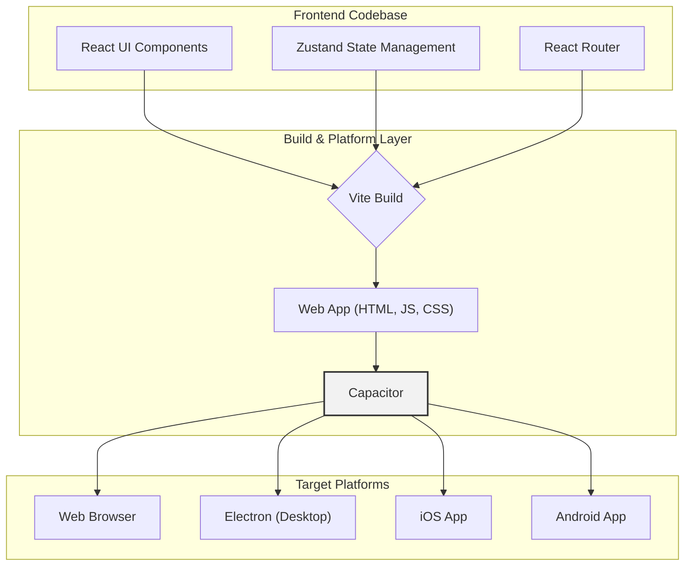

Now-Noting 的前端架构采用现代 Web 技术栈，旨在实现代码复用最大化，通过一次开发，即可覆盖 Web、桌面（通过 Electron 渲染）及移动端（iOS/Android）。该架构以 React 为核心，结合 Vite 构建工具、Tailwind CSS 样式方案以及 Capacitor 跨平台框架，构成了一套高效、可扩展的前端解决方案。

## 1. 核心技术栈与构建系统

前端架构的核心是围绕 React 生态系统构建的。项目选用 Vite 作为开发服务器和构建工具，利用其基于原生 ES 模块的优势，提供了极速的冷启动和模块热更新（HMR）能力，显著提升了开发体验。

技术选型概览如下：

| 类别 | 技术 | 作用 |
| :--- | :--- | :--- |
| **UI 框架** | React | 构建用户界面的核心声明式库。 |
| **构建工具** | Vite | 提供快速的开发环境和优化的生产构建。 |
| **路由管理** | React Router | 管理应用的页面导航和视图切换。 |
| **样式方案** | Tailwind CSS + shadcn/ui | 实现功能优先的原子化 CSS 和可复用的高质量组件。 |
| **状态管理** | Zustand | 提供轻量、简洁的全局状态管理方案。 |
| **跨平台** | Capacitor | 将 Web 应用打包成本地 iOS 和 Android 应用。 |

项目的基础配置文件 `vite.config.ts` 定义了构建入口、代理规则和插件配置，是整个前端应用的起点。例如，它通过 `server.proxy` 配置将 API 请求转发到后端服务，解决了开发环境下的跨域问题。

Sources: [frontend/vite.config.ts](frontend/vite.config.ts#L10-L16)

## 2. UI 组件与样式系统

应用的用户界面（UI）建立在 **shadcn/ui** 组件库之上，并采用 **Tailwind CSS** 进行样式定制。这种组合兼具了预制组件的高效性和原子化 CSS 的灵活性。

- **shadcn/ui**：它并非传统的组件库，而是一套可复制粘贴的、基于 Radix UI 和 Tailwind CSS 构建的组件集合。开发者可以直接将组件源码引入项目，自由修改和扩展，从而避免了复杂的封装和样式覆盖问题。组件定义位于 `frontend/src/components/ui` 目录下。
- **Tailwind CSS**：作为一个功能优先（Utility-First）的 CSS 框架，它让开发者能够直接在 HTML/JSX 中通过组合原子类来构建复杂的界面布局和样式，而无需编写独立的 CSS 文件。配置文件 `tailwind.config.cjs` 定义了主题、颜色、字体等设计系统的基本元素。

这种模式鼓励创建功能明确、样式独立的小型组件，提高了 UI 的一致性和可维护性。

Sources: [frontend/tailwind.config.cjs](frontend/tailwind.config.cjs), [frontend/src/components/ui](frontend/src/components/ui)

## 3. 状态管理与数据流

为了高效管理应用内的全局状态，项目引入了轻量级状态管理库 **Zustand**。与 Redux 等库相比，Zustand 的 API 更为简洁，样板代码更少，同时对 React Hooks 有着良好的支持。

全局状态被组织在 `frontend/src/store` 目录下的多个 "Slice" 中，每个 Slice 负责管理应用的一部分特定状态，例如：

- `userStore.ts`: 存储用户信息、认证 Token 等。
- `noteStore.ts`: 管理笔记列表、当前选中的笔记等。
- `editorStore.ts`: 负责编辑器相关的状态，如字数、保存状态等。
- `settingStore.ts`: 管理应用的各项设置。

这种模块化的状态管理方式使得数据流清晰可追溯。组件通过调用 `useUserStore()`、`useNoteStore()` 等自定义 Hooks 来访问和更新全局状态，实现了状态逻辑与 UI 组件的解耦。

```typescript
// frontend/src/store/userStore.ts
import { create } from 'zustand';

// ...

export const useUserStore = create<IUserStore>()(
  // ...
  (set) => ({
    token: localStorage.getItem('token') || '',
    setToken: (token: string) => {
      localStorage.setItem('token', token);
      set({ token });
    },
    // ...
  }),
);
```

Sources: [frontend/src/store/userStore.ts](frontend/src/store/userStore.ts), [frontend/src/store/noteStore.ts](frontend/src/store/noteStore.ts)

## 4. Capacitor：从 Web 到原生移动应用

Capacitor 是该项目实现跨平台能力的关键。它作为一个桥梁，将基于 React 的 Web 应用打包成可以在 iOS 和 Android 设备上运行的原生应用，并提供了访问原生设备功能（如摄像头、文件系统、状态栏等）的统一 API。



核心配置文件 `capacitor.config.ts` 定义了移动端的应用 ID、名称以及需要集成的原生插件。通过 Capacitor API，Web 代码可以调用原生功能，例如：

- **状态栏控制**: 使用 `@capacitor/status-bar` 插件调整移动端状态栏的颜色和样式，以匹配应用的主题。
- **启动画面**: 使用 `@capacitor/splash-screen` 插件控制应用的启动画面，提升原生体验。

这些原生交互的逻辑通常被封装在自定义 Hooks 或服务中，使业务组件无需关心底层平台的差异。这种架构使得绝大部分代码都能在所有平台上复用，仅在需要调用特定原生功能时编写少量平台相关的代码。

Sources: [frontend/capacitor.config.ts](frontend/capacitor.config.ts), [frontend/src/App.tsx](frontend/src/App.tsx#L38-L51)

---

**下一步**

了解前端架构后，可以进一步探索应用是如何与桌面端容器进行整合与通信的。

- **继续阅读**: [桌面端架构：Electron 主进程与渲染进程通信](9-zhuo-mian-duan-jia-gou-electron-zhu-jin-cheng-yu-xuan-ran-jin-cheng-tong-xin)