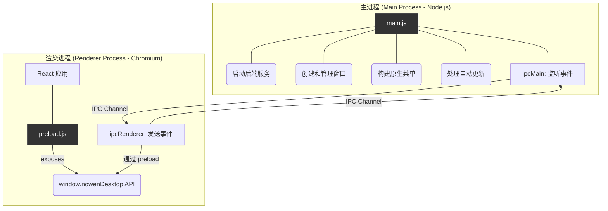
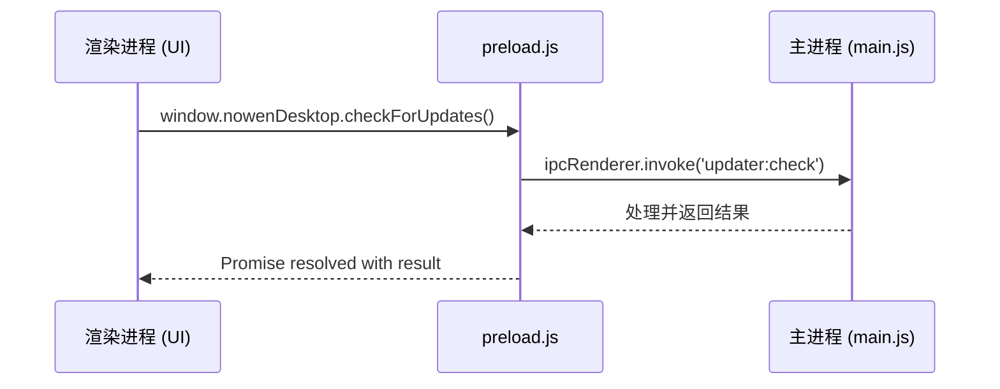
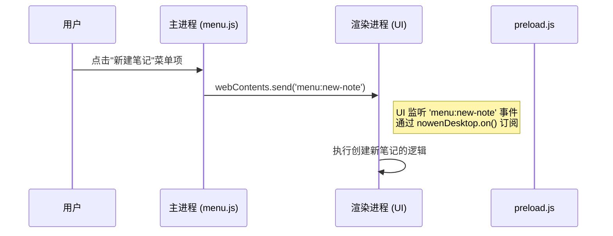

Now-Noting 桌面端应用基于 Electron 构建，其核心架构遵循了 Electron 标准的多进程模型。该模型将应用划分为**主进程 (Main Process)** 和**渲染进程 (Renderer Process)**。理解它们各自的职责以及彼此间的通信机制，是理解桌面端功能实现的关键。本文将深入解析这一架构，特别是两者如何通过进程间通信 (IPC) 安全地协作。

## 架构概览：职责分离的进程模型

Electron 的设计哲学是将运行于 Node.js 环境的后端能力（主进程）与运行于 Chromium 的 Web 前端界面（渲染进程）分离开来。主进程拥有访问操作系统原生功能的全部权限，如文件系统、原生菜单、网络请求等，而渲染进程则负责 UI 的渲染与交互，但运行在一个受限的沙盒环境中。

为了在隔离的进程间建立联系，Now-Noting 采用 Electron 提供的 `contextBridge` 和 `ipcMain`/`ipcRenderer` 模块，构建了一套安全、边界清晰的通信桥梁。



这个模型的核心优势在于：
- **安全性**：通过 `contextBridge` 暴露 API，渲染进程无法直接访问 Node.js 或 Electron 的原生模块，有效防止了潜在的 Web 内容安全漏洞影响到整个系统。这被称为上下文隔离 (Context Isolation)。
- **稳定性**：渲染进程的崩溃不会影响到主进程，使得应用的主体逻辑（如数据服务）能够保持运行，提高了应用的健壮性。
- **职责清晰**：主进程专注于系统级任务，渲染进程专注于 UI 逻辑，使得代码组织和维护更加清晰。

Sources: [electron/main.js](electron/main.js#L1-L22), [electron/preload.js](electron/preload.js#L2-L3)

## Preload 脚本：安全的 API 桥梁

`preload.js` 是连接主进程与渲染进程的关键枢纽。它是一个特殊的脚本，运行在渲染进程中，但拥有访问 Node.js API 的能力。Now-Noting 利用此脚本，通过 Electron 的 `contextBridge.exposeInMainWorld` 方法，向渲染进程的 `window` 对象注入一个名为 `nowenDesktop` 的全局 API。前端 React 应用只能通过这个事先定义好的 API 与主进程通信，而不能直接调用 `require('electron')`。

这种机制强制要求所有跨进程通信都必须通过显式定义的接口进行。在 `preload.js` 中，维护了一个 `allowedChannels` 白名单，用于过滤主进程向渲染进程广播的事件，只有白名单内的事件才能被前端监听到，进一步增强了安全性。

```javascript
// electron/preload.js
const { contextBridge, ipcRenderer } = require("electron");

const allowedChannels = new Set([
  // ...
  "menu:new-note",
  "updater:status",
  "discovery:update",
]);

contextBridge.exposeInMainWorld("nowenDesktop", {
  on(channel, listener) {
    if (!allowedChannels.has(channel)) {
      console.warn("[preload] blocked channel:", channel);
      return () => {};
    }
    const wrapped = (_event, payload) => listener(payload);
    ipcRenderer.on(channel, wrapped);
    return () => ipcRenderer.removeListener(channel, wrapped);
  },
  // ... 其他暴露的 API
});
```

Sources: [electron/preload.js](electron/preload.js#L2-L42)

## 通信模式：双向事件与调用

主进程与渲染进程之间的通信主要有两种模式：单向事件广播和双向请求-响应。

### 渲染进程 → 主进程 (Renderer to Main)

当用户在界面上执行需要原生能力的操作时（例如，检查更新、切换运行模式），渲染进程会调用 `window.nowenDesktop` 上暴露的方法。这些方法内部封装了 `ipcRenderer.invoke` 或 `ipcRenderer.send`。

- **`ipcRenderer.invoke` (请求-响应)**: 用于需要主进程处理并返回结果的异步操作。例如，获取应用版本信息。
- **`ipcRenderer.send` (单向)**: 用于仅需通知主进程执行某项任务，而不需要返回值的场景。例如，上报当前编辑器的格式状态以同步原生菜单栏。

主进程的 `main.js` 中使用 `ipcMain.handle` 和 `ipcMain.on` 来分别监听这两种请求。



| 方法 | 方向 | 场景 | 示例 |
|---|---|---|---|
| `ipcRenderer.invoke` / `ipcMain.handle` | 双向 (异步) | 渲染进程需要主进程处理并返回结果。 | `checkForUpdates()`, `getAppInfo()` |
| `ipcRenderer.send` / `ipcMain.on` | 单向 | 渲染进程向主进程发送通知或数据，不关心返回值。 | `sendFormatState(state)` |

Sources: [electron/main.js](electron/main.js#L509-L519), [electron/preload.js](electron/preload.js#L44-L61)

### 主进程 → 渲染进程 (Main to Renderer)

当主进程需要通知渲染进程更新 UI 时（例如，用户通过原生菜单创建新笔记、自动更新状态变化），主进程会使用 `mainWindow.webContents.send()` 方法广播事件。

渲染进程通过 `window.nowenDesktop.on(channel, callback)` 来订阅这些来自主进程的事件。如前所述，`preload.js` 中的 `allowedChannels` 确保了渲染进程只能订阅预定义的、安全的事件。

一个典型的例子是菜单栏操作：用户点击顶部菜单栏的“新建笔记”，主进程监听到菜单点击事件后，向渲染进程发送 `'menu:new-note'` 消息，前端应用收到该消息后执行相应的路由跳转或状态更新。



Sources: [electron/menu.js](electron/menu.js#L131-L133), [electron/preload.js](electron/preload.js#L7)

通过这套精心设计的 IPC 机制，Now-Noting 桌面端在保证安全和稳定的前提下，实现了原生功能与 Web 界面的深度融合，为用户提供了流畅、统一的跨平台体验。

### 下一步

- 要了解 Electron 应用如何与后端服务集成，请阅读 [整体架构：Monorepo 多端应用实践](6-zheng-ti-jia-gou-monorepo-duo-duan-ying-yong-shi-jian)。
- 对桌面应用的打包和分发流程感兴趣？请参阅 [桌面端应用打包与构建](5-zhuo-mian-duan-ying-yong-da-bao-yu-gou-jian)。
- 想探索前端 UI 的具体实现，可以继续阅读 [前端架构：基于 React 和 Capacitor 的跨平台 UI](8-qian-duan-jia-gou-ji-yu-react-he-capacitor-de-kua-ping-tai-ui)。