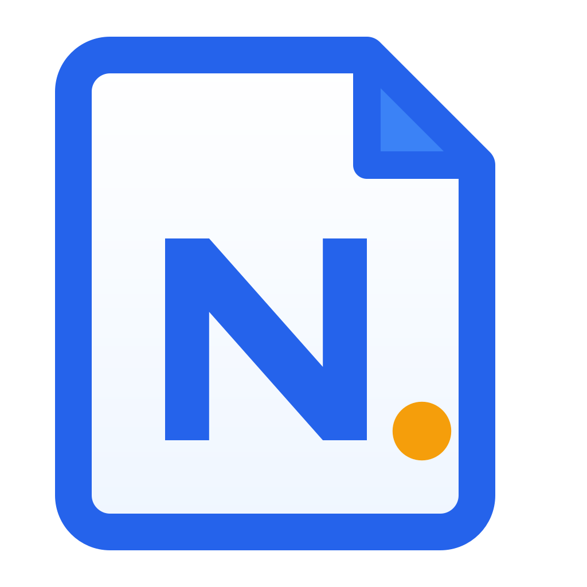

<div align="center">
  
  <h1>Nowen Note</h1>
  <p><strong>An open-source, self-hosted knowledge base, collaborative note app, and task workspace</strong></p>
  <p>
    Unified knowledge tree · Rich text / Markdown editors · AI knowledge Q&A · Real-time collaboration · Tasks and mind maps · Cross-platform clients
  </p>
  <p>
    <a href="./README.md">简体中文</a> ·
    <a href="http://nowen.cn/">Official Website</a> ·
    <a href="http://note.nowen.cn/">Live Demo</a> ·
    <a href="https://github.com/cropflre/nowen-note/releases">Downloads</a> ·
    <a href="./docs/tutorials/README.md">Tutorials</a> ·
    <a href="./docs/tutorials/mcp.en.md">MCP Installation</a> ·
    <a href="./CHANGELOG.md">Changelog</a>
  </p>
</div>

<div align="center">

[](https://github.com/cropflre/nowen-note/releases)
[](https://hub.docker.com/r/cropflre/nowen-note)
[](./LICENSE)
[](https://nodejs.org/)
[](./docker-compose.yml)

</div>

> Nowen Note is more than an editor. It is designed as user-controlled knowledge infrastructure that can run long-term on a NAS or server and remain accessible from the web, desktop, and mobile clients.

> **Remote NAS connection and sign-in:** Nowen Note supports deployment on **UGREEN NAS (UGOS / UGOS Pro)** and **Feiniu NAS (fnOS)**. After deployment, connect and sign in from the web, desktop, or Android client using a LAN IP address, an IPv6 address, or a public domain secured with HTTPS.

## v1.4.10 is available

v1.4.10 focuses on **faster editing, more reliable mobile media uploads, offline attachment recovery, knowledge-tree usability, and reminder correctness**, while expanding templates, import/export, and desktop integration.

- Added duplicate-title prefix warnings while typing, automatic wrapping for long titles, improved Markdown find/replace, and current-directory note search.
- Added drag-to-change hierarchy in the knowledge tree and tightened visibility rules for notes inside encrypted directories.
- Added image rotation and independent reset controls; rich-text paste now preserves text color and cross-note formatting more consistently. Desktop builds also gain native text context menus and system-default opening for local office files.
- Hardened Android/mobile image and video uploads by preserving original file identity, stabilizing multipart uploads, and exposing image/video actions in the compact toolbar.
- Added offline attachment validation, quarantine, and recovery signaling so broken cached blobs do not leak into online rendering. Offline sync now starts disabled until explicitly enabled.
- Made reminder creation timezone-aware with safer date-only deadlines and PostgreSQL schema parity, while fixing backup retention, SiYuan import feedback, and Markdown attachment ZIP round trips.

See the [v1.4.10 Release](https://github.com/cropflre/nowen-note/releases/tag/v1.4.10) and the [full changelog](./CHANGELOG.md).

## Connect AI clients to Nowen Note

Nowen Note includes a supported MCP Server. Claude Code, Cursor, VS Code, and other compatible AI clients can search, read, create, and update notes within the permissions granted by your account and token.

- [MCP Server installation guide](./docs/tutorials/mcp.en.md)
- [中文安装教程](./docs/tutorials/mcp.md)
- [Standalone nowen-mcp package README](./packages/nowen-mcp/README.md)

The currently supported distribution is a source build: install Node.js 20+, build `packages/nowen-mcp`, create a restricted Personal API Token in Nowen Note, and configure the absolute path to `dist/scoped-entry.js` in your client. The guide covers Windows, macOS, Linux/WSL, NAS addresses, Claude Code, Cursor, VS Code, verification, updates, and troubleshooting.

## Why Nowen Note

| | |
| --- | --- |
| **You own the data** | Self-host with Docker or deploy on NAS platforms such as UGREEN UGOS and Feiniu fnOS. Databases, attachments, and backups stay under your control. Attachments can use S3, Cloudflare R2, or MinIO, while backups can be sent through email or WebDAV. |
| **One tree for every document** | Mix folders, rich-text notes, and Markdown notes in one hierarchy. Create documents at the root, drag and sort nodes, import files, expand or collapse the tree, inherit permissions, protect folders with passwords, and publish shared content. |
| **Switch editing formats per note** | Convert notes between rich text and Markdown while preserving major structure, code blocks, and links. Use either format for quick notes, technical documentation, or long-form writing. |
| **Built for individuals and teams** | Tags, tasks, AI, workspaces, notebook permissions, real-time collaboration, public sharing, and guest comments live in one system. |

## Core capabilities

| Module | Current capabilities |
| --- | --- |
| **Unified knowledge tree** | Mixed folders, rich-text notes, and Markdown notes; root-level documents, unlimited nesting, drag sorting, drag-to-change hierarchy, a unified create menu, expand/collapse all, Markdown drag-and-drop or file import, filtering, search, note counts, trash, shared tree views, and three-column browsing with child-folder scope. |
| **Folder security and access control** | Folder passwords, short-lived unlock tokens, directory ACLs, Restricted mode, explicit allow/deny rules, inherited policy evaluation, and protected import/export flows. |
| **Rich text and Markdown** | Tiptap 3, CodeMirror 6, per-note format conversion, live preview, split view, outline navigation, format painter, slash commands, tables, code blocks, KaTeX, Mermaid, footnotes, Callouts, media embeds, cross-note format-preserving paste, duplicate-title prefix warnings, comments, and version history. |
| **Long documents and editor stability** | Complexity detection, Worker analysis, viewport rendering, windowed editing, incremental saves, large-document safe modes, outline navigation, and recovery logic for hidden Markdown markers and cursor state. |
| **Performance and delivery** | Lazy-loaded workspace, editor, task, journal, file, AI, and sharing surfaces; cache validators, Gzip/Brotli precompression, and bundle-budget checks reduce startup and repeated transfer cost. |
| **Image editing** | Crop images and add text, freehand drawing, arrows, shapes, and mosaic effects. Existing remote images can be migrated into local attachments or object storage. |
| **Knowledge organization and search** | Colored tags, favorites, pinning, full-text search, current-directory note search, improved in-document find and replace, backlinks, block references, reverse links, and a knowledge graph. Permission-aware search hides restricted resources before result limits are applied. |
| **AI** | OpenAI-compatible APIs, Qwen, Gemini, DeepSeek, Doubao, and Ollama. Features include continuation, rewriting, translation, title and tag generation, summaries, embeddings, and RAG knowledge Q&A. |
| **Tasks and visualization** | Hierarchical tasks, lists, Kanban, calendar, Gantt/timeline, dependencies, recurrence, reminders, templates, AI task breakdown, My Day, Inbox, time planning, offline tasks/habits, native Android reminder scheduling with creator-timezone/date-only deadline consistency, and mind maps. |
| **Collaboration, permissions, and sharing** | Yjs + WebSocket collaboration, workspaces and roles, directory ACLs, Restricted access, explicit allow/deny policies, ownership transfer, centralized share management, passwords and expiration, guest comments, public knowledge spaces, and rich-text/Markdown inline comments. |
| **Sync and edit protection** | Incremental sync, persistence acknowledgements, draft recovery, and version checks. v1.4.10 adds offline attachment validation, quarantine, and recovery signaling while keeping serial saves and Yjs state protection across Markdown/rich-text format transitions. |
| **Import, export, and migration** | Import Markdown, Word/DOCX, web URLs, WeChat articles, SingleFile HTML, SiYuan ZIP archives, Obsidian, Xiaomi Notes, and other supported sources. Export Markdown, PDF, Word, images, or full ZIP packages with permission mapping, conflict preview, reports, controlled rollback, image access preparation, and footnote handling. |
| **Attachments and storage** | Local attachments organized under `YYYY/MM`; reusable attachment-library insertion, thumbnails, note ownership, reference checks, orphan rescans and cleanup, protected manual uploads, local disk or S3/R2/MinIO storage, plus hardened mobile image/video file identity and multipart uploads. |
| **Accounts and security** | Multiple-account history, remembered accounts, auto-login, remote server connections, session validation and revocation, 2FA, scoped Personal API Tokens, audit logs, protected attachment access, and concealment of restricted-resource existence. |
| **Backups, automation, and developer APIs** | Local backups, full ZIP backups, email backup, encrypted WebDAV backup credentials, managed Docker updates and rollback checks, webhooks, plugins, OpenAPI, TypeScript SDK, CLI, [MCP Server](./docs/tutorials/mcp.en.md), and a browser clipper. |
| **Cross-platform access** | Web, Electron for Windows/macOS/Linux, Android, iOS project, HarmonyOS project, and Docker/NAS deployment. UGREEN UGOS and Feiniu fnOS are supported, and clients can connect through IPv4, IPv6, or a domain name. Android includes in-app gesture image preview and native task notifications. |

## Recent highlights

### v1.4.10 · 2026-08-12

#### Editing and search

- Duplicate-title prefix warnings surface possible duplicates while a title is being entered, and long titles now wrap within the editor instead of overflowing.
- Markdown find/replace has a more resilient narrow-width layout, and search can be scoped to notes in the current directory.
- Rich-text copy/paste between notes preserves formatting and text colors more consistently.

#### Images, attachments, and mobile

- The image viewer adds rotation and independent reset controls, with rotation state preserved correctly in fullscreen mode.
- Mobile image/video uploads keep original File identity across DataTransfer, queue, progress, and multipart boundaries, with real uploaded video size validation.
- Image and video actions are available in the compact mobile toolbar, while short-viewport menus and scrolling settings surfaces receive additional layout fixes.
- Offline attachment blobs are validated, quarantined when corrupted, and surfaced through a recovery signal instead of contaminating online rendering.

#### Knowledge tree, templates, and import/export

- Knowledge-tree nodes can be dragged across hierarchy levels, and encrypted-directory visibility boundaries are tightened.
- Note templates support saving, creating notes from templates, mobile entry points, an in-app save dialog, and cleanup protection for template attachments.
- Markdown attachment ZIP round-trip import is fixed, while SiYuan import gets better drag recognition, recovery-directory persistence, and no-response feedback.

#### Tasks, backups, and desktop integration

- Reminder scheduling now preserves creator timezone context, date-only deadline semantics, and PostgreSQL migration/schema parity across normal creation and quick capture.
- db-only backup retention is unified for automatic and manual backups, including persistence of disabled backup settings.
- Desktop builds add a native text context menu and can open local office attachments with the operating system's default application.
- Release downloads gain stronger GitHub asset fallback and stable platform/install-type grouping.

See [CHANGELOG.md](./CHANGELOG.md) and the [v1.4.10 Release](https://github.com/cropflre/nowen-note/releases/tag/v1.4.10) for complete details.

## Screenshots

### Desktop

| AI writing assistant | AI provider settings |
| :---: | :---: |
|  |  |

### Mobile

| Sidebar | Note list | Editor |
| :---: | :---: | :---: |
|  |  |  |

## Website and demo

- Website: <http://nowen.cn/>
- Demo: <http://note.nowen.cn/>
- Username: `demo`
- Password: `demo123456`

> The demo is reset periodically. Do not store private or important data in it.

## Quick deployment

### Docker Compose (recommended)

Docker Engine and Docker Compose v2 are required.

```bash
git clone https://github.com/cropflre/nowen-note.git
cd nowen-note
docker compose up -d
```

Open `http://<server-ip>:3001`.

Default administrator account:

```text
Username: admin
Password: admin123
```

> Change the default password immediately. Public deployments should also use HTTPS, backups, a correct public origin, and restricted CORS settings.

### UGREEN NAS / Feiniu NAS remote connection and sign-in

Nowen Note can be deployed on **UGREEN NAS (UGOS / UGOS Pro)** and **Feiniu NAS (fnOS)**. Use the corresponding `.upk` or `.fpk` package from Releases, or deploy with Docker Compose.

After the service starts:

- **LAN access:** Open `http://<nas-lan-ip>:3001` in a browser.
- **Remote access:** Enter the NAS public domain, IPv4 address, or IPv6 service address in the web, desktop, or Android client, then sign in.
- **Public deployment:** Configure an HTTPS reverse proxy. Do not expose an unencrypted HTTP service directly to the internet.

See available packages in [GitHub Releases](https://github.com/cropflre/nowen-note/releases).

Check status and logs:

```bash
docker compose ps
docker compose logs -f --tail=200 nowen-note
```

### Upgrade from an earlier release

Create a full backup first and confirm that both the database and attachment directory are persisted.

```bash
docker compose pull
docker compose up -d
```

To pin the current stable release:

```bash
NOWEN_IMAGE_TAG=v1.4.10 docker compose up -d
```

> v1.4.10 specifically improves title and Markdown editing, knowledge-tree hierarchy changes, mobile media uploads, offline attachment recovery, and timezone-aware reminders. After upgrading, verify sign-in, note editing, image/video uploads, offline attachments, reminders, templates, import/export, and backups. Rolling back an image does not roll back the database.

### Managed Docker updates (optional)

Managed updates only support the official [`docker-compose.yml`](./docker-compose.yml) and are disabled by default. The main application container does not mount the Docker socket; a separate restricted updater container performs the update.

```bash
cp .env.example .env
printf '\nNOWEN_UPDATER_TOKEN=%s\n' "$(openssl rand -hex 32)" >> .env
NOWEN_IMAGE_TAG=v1.4.10 docker compose --profile updater up -d
```

Administrators can then run preflight checks, create a full backup, update, verify health, and roll back the image from Settings → About → Version.

> Rolling back an image does not roll back the database. Keep independent production backups.

See [Docker online update and recovery](./docs/docker-online-update.md).

### Run only the main container

```bash
docker run -d \
  --name nowen-note \
  --restart unless-stopped \
  -p 3001:3001 \
  -e TZ=Asia/Shanghai \
  -v /opt/nowen-note/data:/app/data \
  cropflre/nowen-note:v1.4.10
```

## Data, backups, and configuration

### Persistent directory

The persistent directory inside the container is **`/app/data`**, not `/data`. The default Compose file uses the `nowen-note-data` Docker volume.

```text
/app/data/
├── nowen-note.db
├── attachments/
├── backups/
├── fonts/
└── .jwt_secret
```

- SQLite is the default production database at `/app/data/nowen-note.db`.
- Attachments are stored under `/app/data/attachments` and organized by `YYYY/MM`.
- Automatic backups are stored under `/app/data/backups` by default.
- Map `BACKUP_DIR` to an independent physical disk and follow a 3-2-1 backup strategy for production.
- Third-party image-host uploads are retired. New images use the attachment system; historical remote images can be migrated.
- PostgreSQL adaptation and migration are still under validation. Production deployment and recovery remain based on SQLite.

### Common environment variables

See [`.env.example`](./.env.example) for the complete template.

| Variable | Default | Purpose |
| --- | --- | --- |
| `NOWEN_PORT` | `3001` | Exposed Compose port |
| `TZ` | `Asia/Shanghai` | Container timezone |
| `PUBLIC_WEB_ORIGIN` | empty | Public or reverse-proxy origin used to generate share links |
| `JWT_SECRET` | generated and persisted | Session signing and fallback encryption; must match across instances |
| `BACKUP_DIR` | `/app/data/backups` | Automatic backup directory |
| `BACKUP_WEBDAV_ENCRYPTION_KEY` | falls back to `JWT_SECRET` | Encrypts stored WebDAV credentials; use a dedicated production key |
| `CORS_ORIGINS` | native client origins | Additional comma-separated web origins |
| `MAX_ATTACHMENT_SIZE_MB` | `100` | Maximum attachment size |
| `ATTACHMENT_STORAGE` | `local` | Set to `s3` for S3/R2/MinIO |
| `CALENDAR_EXPORT_ENCRYPTION_KEY` | empty | Encrypts calendar S3 export credentials |
| `NOWEN_UPDATER_TOKEN` | empty | Enables the managed Docker updater |

- [Object storage](./docs/object-storage.md)
- [WebDAV backup](./docs/webdav-backup.md)
- [Email backup](./docs/backup-email-smtp.md)

## Client and platform status

| Platform | Distribution / build | Status |
| --- | --- | --- |
| **Web / Docker** | Docker Hub or source build | Recommended deployment; supports `amd64`, `arm64`, or multi-architecture images |
| **Windows / macOS / Linux** | [GitHub Releases](https://github.com/cropflre/nowen-note/releases) or `npm run electron:build` | Electron client can connect to a remote service or use the local backend |
| **Android** | Release APK or Capacitor build under `frontend/` | Actively maintained; system share import, Markdown file import, immersive editing, mobile knowledge tree, gesture image preview, native task reminders, and remote NAS service sign-in |
| **iOS** | Capacitor project and GitHub Actions/TestFlight flow | Requires Apple signing and a developer account; see [iOS release guide](./docs/iOS-Release.md) |
| **HarmonyOS** | Open [`nowen-harmony/`](./nowen-harmony/) in DevEco Studio | ArkTS + ArkWeb MVP; some native capabilities are still being completed |
| **fnOS** | `.fpk` in Releases | Supports Feiniu NAS installation. The current package primarily targets x86_64; after deployment, connect and sign in using a LAN or public service address. |
| **UGREEN UGOS** | `.upk` in Releases or build scripts | Supports UGREEN NAS installation, depending on device architecture and app installation support; after deployment, connect and sign in using a LAN or public service address. |
| **Other NAS** | Docker Compose | Synology, QNAP, ZSpace, and similar devices can use the Docker deployment |

> Available packages vary by release. Check [GitHub Releases](https://github.com/cropflre/nowen-note/releases).

## Local development

Requires Node.js 20+, npm, and Git. Electron and native builds also require platform toolchains.

```bash
git clone https://github.com/cropflre/nowen-note.git
cd nowen-note
npm install
npm run install:all
```

Start two terminals:

```bash
npm run dev:backend
```

```bash
npm run dev:frontend
```

Open `http://localhost:5173`.

Common commands:

```bash
npm run build:all
npm run electron:dev
npm run electron:build
(cd backend && npm test)
(cd frontend && npm run test:run)
```

Android:

```bash
cd frontend
npm run cap:build
npx cap open android
```

> Capacitor 8 requires Node.js 22+ for Android release tooling. Regular web and Electron development can continue to use the project's Node.js 20+ baseline.

iOS:

```bash
npm run cap:sync:ios
npm run cap:open:ios
```

## Technology stack

| Layer | Main technologies |
| --- | --- |
| **Frontend** | React 18, TypeScript, Vite 5, Tailwind CSS, Tiptap 3, CodeMirror 6, Yjs, IndexedDB |
| **Backend** | Node.js 20, Hono 4, WebSocket, better-sqlite3, FTS5, sqlite-vec, sharp |
| **Desktop** | Electron 33, electron-builder, electron-updater |
| **Mobile** | Capacitor 8 for Android/iOS, ArkTS + ArkWeb for HarmonyOS |
| **Storage and backup** | SQLite, local attachments, S3/Cloudflare R2/MinIO, email and WebDAV backups; PostgreSQL is under validation |
| **Developer APIs** | OpenAPI 3.0, TypeScript SDK, CLI, MCP Server, Webhook |

## Repository layout

```text
nowen-note/
├── frontend/       # React web app and Capacitor clients
├── backend/        # Hono APIs, database, sync, and background tasks
├── electron/       # Electron main process and packaging
├── packages/       # SDK, CLI, MCP, and developer packages
├── nowen-harmony/  # HarmonyOS ArkTS / ArkWeb client
├── docs/           # Deployment, tutorials, and design documents
└── scripts/        # Build, migration, packaging, and release scripts
```

## Documentation

- [MCP Server installation and usage](./docs/tutorials/mcp.en.md)
- [MCP Server 中文安装教程](./docs/tutorials/mcp.md)
- [Tutorial center](./docs/tutorials/README.md)
- [Feature documentation](http://nowen.cn/docs/nowen-note-features)
- [Installation and troubleshooting](http://nowen.cn/docs/nowen-note-help)
- [API documentation](http://nowen.cn/docs/nowen-note-api)
- [Deployment guide](./docs/deployment.md)
- [Docker update and recovery](./docs/docker-online-update.md)
- [WebDAV backup](./docs/webdav-backup.md)
- [Object storage](./docs/object-storage.md)
- [Email backup](./docs/backup-email-smtp.md)
- [ARM64 deployment](./docs/deploy-arm64.md)
- [iOS release guide](./docs/iOS-Release.md)
- [Privacy policy](./docs/PRIVACY.md)
- [Browser clipper](https://chromewebstore.google.com/detail/nowen-note-web-clipper/nglkodhfdbnfielchjpkjhenfaecafpg)
- OpenAPI is available at `/api/openapi.json` after startup.

## Current boundaries

- **Database:** SQLite is the fully supported production default. PostgreSQL adapters, schemas, and partial dual-database tests exist, but production switching is not yet enabled.
- **Format conversion:** Rich-text/Markdown conversion preserves major structures where possible. Highly customized HTML, complex extension nodes, or third-party syntax may still require manual review.
- **WebDAV:** Used for completed backup files, not real-time sync, live database storage, or attachment hosting. Remote retention must be managed separately.
- **Managed Docker updates:** Only support the official managed Compose deployment.
- **Third-party image hosting:** Upload integration is retired; only historical configuration cleanup and image migration remain.
- **macOS:** Unsigned or unnotarized packages may require removing quarantine attributes; see the desktop tutorial.
- **Mobile:** Android has the most complete maintenance coverage. iOS and HarmonyOS distribution, signing, and some native bridges remain platform-dependent.

## Releases

The README documents stable capabilities, recent highlights, and deployment. Complete commit-level history remains in the changelog.

- [Latest release](https://github.com/cropflre/nowen-note/releases)
- [Full changelog](./CHANGELOG.md)
- [Issues and roadmap](https://github.com/cropflre/nowen-note/issues)

## Contributing

Issues, feature suggestions, and pull requests are welcome. Before submitting code, run at least:

```bash
npm run build:all
(cd backend && npm test)
(cd frontend && npm run test:run)
```

Feedback channels:

- [GitHub Issues](https://github.com/cropflre/nowen-note/issues)
- QQ group: `1093473044`

## Support the project

If Nowen Note helps you, sponsorship supports continued maintenance and development.

<table align="center">
  <tr>
    <th>WeChat</th>
    <th>Alipay</th>
  </tr>
  <tr>
    <td align="center"></td>
    <td align="center"></td>
  </tr>
</table>

Read the [author's note](./AUTHOR_STORY.md).

## License

Nowen Note is licensed under the [GNU General Public License v3.0](./LICENSE).

<!-- CHANGELOG:BEGIN -->
<!-- Detailed release history lives in CHANGELOG.md. Keep the README focused on stable capabilities and recent highlights. -->
<!-- CHANGELOG:END -->
